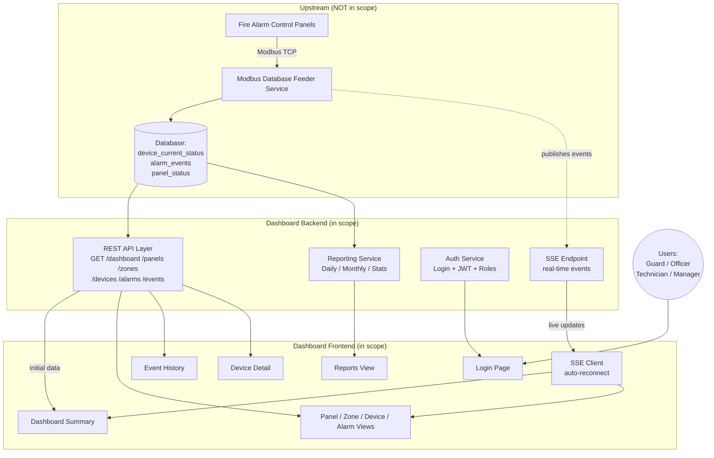
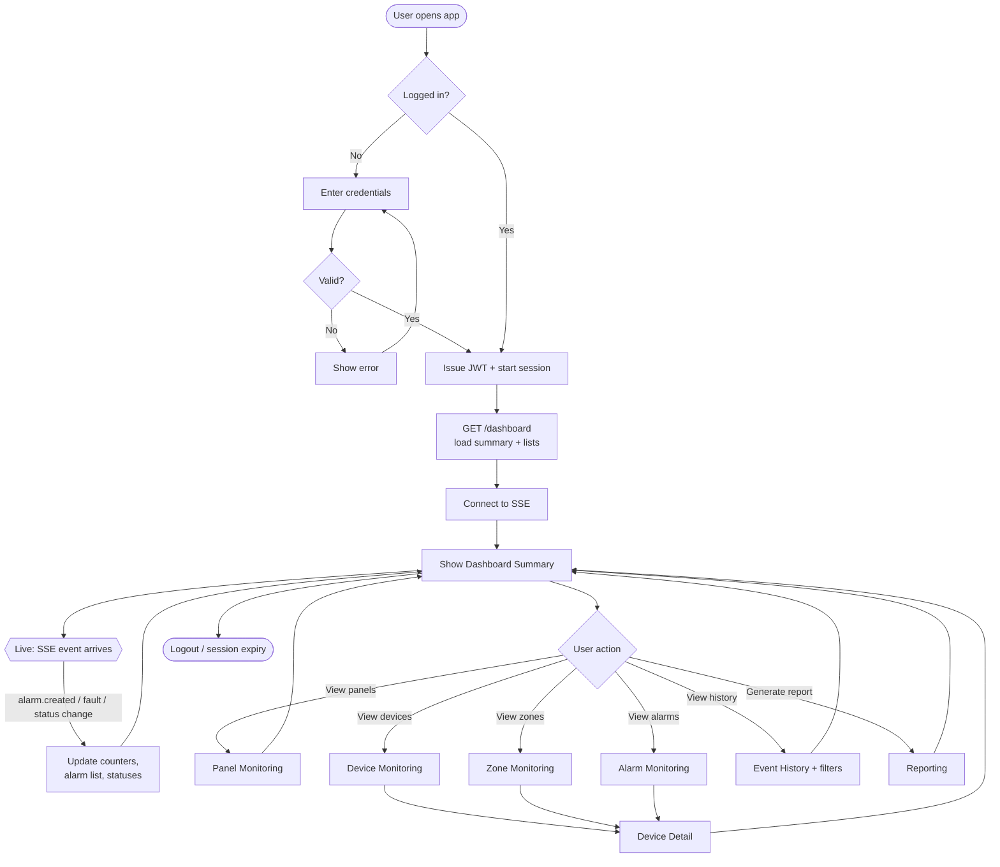
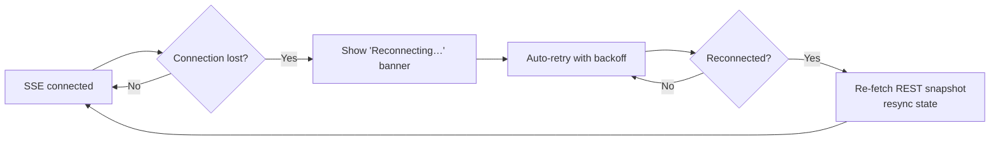

# Product Requirements Document (PRD)
## Fire Alarm Monitoring Dashboard

| Field | Value |
|---|---|
| **Document Owner** | Product Management |
| **Version** | 1.2 |
| **Last Updated** | 2026-07-12 |
| **Status** | Reviewed — Open Questions Resolved; read-only v1 confirmed |
| **Source Reference** | `docs/Fire_Alarm_Modbus_Technical_Module_Description.md` (Section 2) |
| **Out of Scope (explicit)** | Modbus Database Feeder Service — provided as an upstream dependency, **not built here** |

---

## 1. Structured Project Overview

**Product Name:** Fire Alarm Monitoring Dashboard

**One-liner:** A real-time web dashboard that lets safety and facility teams *see the status of every fire alarm panel, zone, and device in one place* — without touching hardware or technical tooling.

**Product Type:** Fullstack web application (read-only monitoring client).

**Core Principle:** The Dashboard **never talks to Modbus hardware**. It consumes already-processed data through a **REST API** (initial load) and receives live changes through **Server-Sent Events (SSE)**. All hardware polling, decoding, and event generation are handled upstream by the Modbus Database Feeder Service.

**Primary Value:**
- See fire alarm health at a glance (summary counters).
- Get notified of alarms and faults the moment they happen (live, no refresh).
- Drill from a building overview down to a single detector.
- Review history and export simple reports for compliance.

**Design North Star:** *A security guard with no technical background must understand the screen in under 5 seconds.* Big status colors, plain language, minimal clicks.

| Aspect | Summary |
|---|---|
| **Goal** | Real-time visibility into fire alarm system status |
| **Users** | Security guards, facility/safety officers, maintenance technicians, managers |
| **Data In** | REST API (snapshot) + SSE (live updates) |
| **Data Out** | Screen visualization + simple reports |
| **Key Constraint** | Read-only; simple UX; no direct hardware access |

---

## 2. Background

Industrial and commercial facilities operate **Fire Alarm Control Panels (FACP)** connected to many field devices — smoke detectors, heat detectors, manual call points, fire bells, buzzers, and I/O modules. Historically these panels are monitored **physically at the panel itself**: a guard must walk to the panel room to read a small LED/LCD display.

An upstream service — the **Modbus Database Feeder Service** — already exists (or is being built separately). It polls the panels over Modbus TCP, decodes raw registers into meaningful business status, detects changes, and writes them to a database while publishing real-time events over SSE.

What is **missing** is the human-facing layer: a clean, centralized dashboard that turns that processed data into something a non-technical person can monitor from anywhere on the network. This PRD defines **that dashboard only**.

**Where this fits in the overall data flow:**

```
[FACP Hardware] → [Modbus Feeder Service] → [Database + SSE]  →  ⭐ THIS PRODUCT: Dashboard
     (upstream, NOT in scope)                                        (REST read + SSE listen)
```

---

## 3. Problems / User Pain Points

| # | Pain Point | Who Feels It | Impact |
|---|---|---|---|
| P1 | Status is only visible at the physical panel | Security guard | Slow response; must walk to panel room |
| P2 | No single view across multiple panels/buildings | Facility/safety officer | Blind spots; can't prioritize |
| P3 | Alarms are noticed late (no live push) | Everyone | Delayed emergency response = safety risk |
| P4 | Hard to tell an *alarm* from a *fault* from *offline* | Guard / technician | Confusion, wrong action taken |
| P5 | No history — "what happened last night?" is unanswerable | Manager / technician | No accountability, no troubleshooting trail |
| P6 | Existing tools are technical (register numbers, hex) | Non-technical staff | Unusable without training |
| P7 | Manual, tedious reporting for compliance/audits | Manager | Wasted hours, error-prone |
| P8 | Can't quickly locate which device/zone is affected | Technician | Slow maintenance, longer downtime |

---

## 4. Solution

A **role-aware, real-time monitoring dashboard** that directly addresses each pain point:

| Pain | Solution Feature |
|---|---|
| P1, P2 | **Dashboard Summary** + **Panel/Zone/Device Monitoring** — one screen, all panels |
| P3 | **Real-time SSE listener** + **in-app alert** — toast banner, audible alarm, and badge fire the moment an alarm arrives, no refresh |
| P4 | **Color-coded, plain-language status** — Normal (green), Alarm (red), Fault (amber), Offline (grey) |
| P5 | **Event History** with timeline + filters |
| P6 | **Simple UX** — labels like "Smoke Detector – Warehouse A", not register 40002 |
| P7 | **Reporting** — one-click Daily/Monthly + statistics |
| P8 | **Device Detail** + drill-down from summary → panel → zone → device |

**Solution Pillars:**
1. **Glanceable** — summary counters and big color status tiles.
2. **Live** — SSE-driven updates with auto-reconnect.
3. **Drill-down** — overview to single device in 2–3 clicks.
4. **Accountable** — searchable history + exportable reports.
5. **Secure** — login, JWT, role-based access.

---

## 5. High-Level Architecture



**Architectural Notes:**
- Frontend loads a **snapshot via REST**, then **subscribes to SSE** for deltas.
- SSE client **auto-reconnects**; on reconnect it re-fetches REST snapshot to avoid missed events (state resync).
- Backend is a **read layer** over the shared database + a **pass-through/relay for SSE** events published by the Feeder.
- No write-back to hardware; the Dashboard is strictly **monitoring**.

---

## 6. User Flow



**Connection-loss sub-flow (resilience):**



---

## 7. Scope

### 7.1 In Scope (This Release)

| Module | Included |
|---|---|
| **Authentication** | Login, JWT auth, role-based authorization, session management |
| **Dashboard Summary** | Panel Online/Offline, Active Alarm, Active Fault, Active Device, Last Update |
| **Panel Monitoring** | Per-panel status: Online / Offline / Last Communication |
| **Zone Monitoring** | Per-zone status: Normal / Alarm / Fault / Offline |
| **Device Monitoring** | All device types with Current Status, Severity, Location, Last Update |
| **Alarm Monitoring** | Active alarms: Timestamp, Panel, Zone, Device, Severity, Status |
| **Event History** | Timeline + filters (date, panel, zone, device, severity, event type) |
| **Device Detail** | Device info, current status, register mapping (read-only display), alarm history, last comm |
| **Real-time Listener (SSE)** | Connect, auto-reconnect, live update of counters/alarms/panel status |
| **In-App Notifications** | Real-time toast/banner, audible alarm (while dashboard is open), alarm indicator badge, SSE-driven — **in-app only** |
| **REST API Layer (consumption)** | `GET /dashboard /panels /zones /devices /alarms /events` |
| **Reporting** | Daily report, Monthly report, Alarm/Fault/Device statistics — exportable as **PDF and CSV** |

### 7.2 Out of Scope (This Release)

- ❌ **Modbus Database Feeder Service** (explicitly excluded — upstream dependency).
- ❌ Direct Modbus/hardware communication or panel configuration.
- ❌ Writing/controlling devices (silencing alarms, resetting panels).
- ❌ Editing register mappings / device provisioning (display-only here).
- ❌ Native mobile apps (responsive web is sufficient).
- ❌ External notifications (push, SMS, email, WhatsApp, mobile) — v1 is **in-app only**; external channels are a future consideration.
- ❌ Multi-language UI beyond primary language — future consideration.

> **Scope guardrail:** We deliberately keep this to *monitoring + history + simple reports*. Anything requiring hardware control or complex configuration is intentionally excluded to keep the product easy to build and easy to use.

### 7.3 Scale & Performance Targets

| Dimension | Target |
|---|---|
| Max Fire Alarm Control Panels | **100 panels** |
| Max field devices | **~20,000 devices** |
| Large lists/tables | **Server-side pagination** by default |
| Virtualization | Applied when rendering **> 500 rows** |
| Event History retention | **5 years** (audit/investigation) |
| Dashboard query window | Recent **30–90 days** for performance; older records via reports/audit queries |

### 7.4 Assumptions & Dependencies

- REST API and SSE endpoints are provided and stable (contract owned by the Feeder Service).
- REST list endpoints support pagination parameters to serve the scale targets above.
- Database tables (`device_current_status`, `alarm_events`, `panel_status`, `panel_connection_log`) are populated by upstream.
- User accounts and roles are provisioned (via the auth backend / seed).
- Network access between browser and backend is available on the facility LAN.

---

## 8. User Roles

| Role | Description | Permissions (v1) |
|---|---|---|
| **Administrator** | System owner | Full system administration: user management, system configuration, device management, dashboard monitoring, reports, and event history |
| **Safety Officer** | Oversees safety & monitoring | Dashboard monitoring, alarm monitoring, event history, reports, and device information |
| **Viewer** | Read-only oversight | Read-only access to dashboards, device status, alarm status, and reports |

> **Permission note:** v1 is strictly **read-only monitoring** — there are **no alarm control actions** (acknowledge, reset, silence, or control). The **final Role → Permission Matrix will be confirmed and approved by the Safety Team during the detailed design phase, before implementation.** The roles above are the v1 working assumption; any future alarm-interaction capability requires Safety Team approval.

---

## 9. User Stories

### Epic A — Authentication
- **US-A1:** As a user, I want to log in with my credentials so that only authorized staff can view the fire alarm status.
- **US-A2:** As the system, I want to issue and validate a JWT so sessions are secure and stateless.
- **US-A3:** As an admin, I want role-based access so each role sees only what it should.
- **US-A4:** As a user, I want my session to expire safely so an unattended screen isn't left open indefinitely.

### Epic B — Dashboard Summary
- **US-B1:** As a guard, I want to see counts of Panels Online/Offline, Active Alarms, Active Faults, and Active Devices at a glance so I know overall health immediately.
- **US-B2:** As a guard, I want a "Last Update" timestamp so I trust the data is current.
- **US-B3:** As a guard, I want the summary counters to update live (no refresh) when something changes.

### Epic C — Panel Monitoring
- **US-C1:** As an officer, I want to see each panel's Online/Offline status and Last Communication time so I know which panels are healthy.
- **US-C2:** As an officer, I want offline panels visually highlighted so I can act fast.

### Epic D — Zone Monitoring
- **US-D1:** As a guard, I want each zone shown as Normal/Alarm/Fault/Offline with clear colors so I instantly see problem areas.
- **US-D2:** As a guard, I want to click a zone to see the devices inside it.

### Epic E — Device Monitoring
- **US-E1:** As a technician, I want a list of all devices with type, current status, severity, location, and last update so I can find issues.
- **US-E2:** As a technician, I want to filter/search devices by status or location so I can focus.

### Epic F — Alarm Monitoring
- **US-F1:** As a guard, I want a live list of active alarms with timestamp, panel, zone, device, severity, and status so I can respond to emergencies.
- **US-F2:** As a guard, I want the newest/most severe alarm to stand out.

### Epic G — Event History
- **US-G1:** As a manager, I want a timeline of past events so I can review what happened.
- **US-G2:** As a manager, I want to filter history by date, panel, zone, device, severity, and event type.

### Epic H — Device Detail
- **US-H1:** As a technician, I want to open a device and see its information, current status, register mapping, alarm history, and last communication so I can troubleshoot.

### Epic I — Real-time (SSE)
- **US-I1:** As a user, I want the dashboard to reflect changes in real time so I never miss an alarm.
- **US-I2:** As a user, I want the app to auto-reconnect and resync if the connection drops so I always see accurate data.

### Epic J — Reporting
- **US-J1:** As a manager, I want a Daily and Monthly report so I can meet compliance needs.
- **US-J2:** As a manager, I want alarm/fault/device statistics so I can spot trends.
- **US-J3:** As a manager, I want to export reports as PDF (for printing/audit) and CSV (for analysis) so I can share and process the data.

### Epic K — In-App Notifications
- **US-K1:** As a guard, I want a toast/banner to pop up the instant a new alarm arrives so I notice even if I'm looking at another view.
- **US-K2:** As a guard, I want an audible alarm sound (while the dashboard is open) so I'm alerted without staring at the screen.
- **US-K3:** As a guard, I want an alarm indicator badge showing the active-alarm count so I always know if something needs attention.

### Epic L — Scale & Performance
- **US-L1:** As an officer at a large site, I want long device/event lists to load quickly (paginated) so the dashboard stays fast with thousands of devices.
- **US-L2:** As a manager, I want historical events kept for years so I can support audits and investigations.

---

## 10. Acceptance Criteria

Written in Given/When/Then. IDs map to user stories above.

### Authentication
- **AC-A1:** *Given* a user on the login page, *when* they enter valid credentials, *then* they receive a JWT and land on the Dashboard Summary.
- **AC-A2:** *Given* invalid credentials, *when* they submit, *then* a clear error is shown and no token is issued.
- **AC-A3:** *Given* an expired/invalid token, *when* any protected page is requested, *then* the user is redirected to login.
- **AC-A4:** *Given* a logged-in user of role X, *when* they access a feature not permitted to X, *then* access is denied (hidden or 403).

### Dashboard Summary
- **AC-B1:** *Given* a successful login, *when* the summary loads, *then* it shows Panel Online, Panel Offline, Active Alarm, Active Fault, Active Device counts, and Last Update — all from `GET /dashboard`.
- **AC-B2:** *Given* the dashboard is open, *when* an SSE event changes a counter, *then* the affected counter and Last Update refresh within ~1–2 seconds **without a page reload**.
- **AC-B3:** *Given* zero active alarms, *then* the Active Alarm tile shows a clear "0 / All Normal" state (never blank).

### Panel Monitoring
- **AC-C1:** *Given* the Panel view, *then* every panel shows Online/Offline and Last Communication time.
- **AC-C2:** *Given* a panel goes offline (SSE), *then* its status flips to Offline and is visually highlighted live.

### Zone Monitoring
- **AC-D1:** *Given* the Zone view, *then* each zone displays exactly one status of Normal/Alarm/Fault/Offline with the correct color code.
- **AC-D2:** *Given* a zone in Alarm, *when* clicked, *then* the affected devices in that zone are shown.

### Device Monitoring
- **AC-E1:** *Given* the Device view, *then* each device row shows type, current status, severity, location, and last update.
- **AC-E2:** *Given* a status filter is applied, *then* only matching devices are listed.

### Alarm Monitoring
- **AC-F1:** *Given* the Alarm view, *then* each active alarm shows timestamp, panel, zone, device, severity, and status.
- **AC-F2:** *Given* a new alarm arrives via SSE, *then* it appears at the top of the list live and is visually emphasized by severity.

### Event History
- **AC-G1:** *Given* the History view, *then* events are shown in reverse-chronological timeline order.
- **AC-G2:** *Given* any combination of filters (date/panel/zone/device/severity/event type), *then* results update to match; clearing filters restores the full list.

### Device Detail
- **AC-H1:** *Given* a device is opened, *then* it shows Device Information, Current Status, Register Mapping (read-only), Alarm History, and Last Communication.

### Real-time (SSE)
- **AC-I1:** *Given* the app is open, *when* the SSE connection drops, *then* a non-blocking "Reconnecting…" indicator appears and auto-retry begins.
- **AC-I2:** *Given* the connection is restored, *then* the app re-fetches the REST snapshot so displayed state matches reality (no stale/missed events).

### Reporting
- **AC-J1:** *Given* the Reports view, *when* a Daily or Monthly report is requested, *then* it generates for the selected period and can be viewed/exported.
- **AC-J2:** *Given* a report period, *then* alarm, fault, and device statistics are shown accurately for that period.
- **AC-J3:** *Given* a generated report, *when* the user chooses export, *then* both **PDF** and **CSV** formats are available and download correctly.

### In-App Notifications
- **AC-K1:** *Given* the dashboard is open, *when* a new alarm arrives via SSE, *then* a non-blocking toast/banner appears identifying the device/zone.
- **AC-K2:** *Given* a new alarm arrives, *then* an audible alarm sound plays while the dashboard is open (with a visible mute control).
- **AC-K3:** *Given* one or more active alarms, *then* the alarm indicator badge shows the current active-alarm count and clears to zero when all alarms are restored.
- **AC-K4:** *Given* notifications, *then* they are **in-app only** — no SMS/email/push/WhatsApp is sent from v1.

### Scale & Performance
- **AC-L1:** *Given* up to 100 panels and ~20,000 devices, *when* a list/table loads, *then* it uses server-side pagination and remains responsive.
- **AC-L2:** *Given* a list/table exceeding 500 rows, *then* row virtualization is applied so scrolling stays smooth.
- **AC-L3:** *Given* Event History, *then* records are retained for 5 years; dashboard views default to the recent 30–90 day window for performance while older records remain queryable via reports.

### Usability (cross-cutting)
- **AC-U1:** Status colors are consistent everywhere: Normal=green, Alarm=red, Fault=amber, Offline=grey.
- **AC-U2:** Every screen uses plain labels (e.g., "Smoke Detector – Warehouse A"), never raw register numbers in primary views.
- **AC-U3:** A first-time, non-technical user can identify whether there is an active alarm within 5 seconds of the summary loading.

---

## 11. Scenario Use Cases

Concrete end-to-end scenarios covering normal, edge, and failure paths.

### UC-1: Normal Monitoring (Happy Path)
1. Guard logs in → JWT issued.
2. Dashboard Summary loads via `GET /dashboard`: 4 panels online, 0 offline, 0 alarms, 0 faults, Last Update just now.
3. SSE connects. All zones green.
4. **Outcome:** Guard confirms "all normal" in seconds and continues rounds.

### UC-2: Fire Alarm Triggered (Critical)
1. A smoke detector in Warehouse A enters ALARM.
2. Feeder publishes `alarm.created` → SSE.
3. **Live, no refresh:** a toast/banner pops, the audible alarm sounds, the badge goes 0→1; Active Alarm counter goes 0→1 (red); Warehouse A zone turns red; alarm appears at top of Alarm Monitoring with timestamp/panel/zone/device/severity.
4. Guard clicks the alarm → Device Detail shows the exact detector and location.
5. **Outcome:** Guard is alerted even while on another view, dispatches response immediately; no walk to panel room.

### UC-3: Device Fault (Maintenance)
1. A heat detector reports FAULT (e.g., dirty/failed sensor).
2. SSE fault event arrives → Active Fault counter increments (amber); device row shows Fault.
3. Technician filters Device Monitoring by status=Fault, opens Device Detail, reviews alarm history + last communication.
4. **Outcome:** Technician locates and services the faulty device.

### UC-4: Panel Goes Offline (Connectivity)
1. A panel loses communication.
2. SSE offline event arrives → Panel Online 4→3, Panel Offline 0→1; panel highlighted in Panel Monitoring; zones under it show Offline (grey).
3. **Outcome:** Officer knows monitoring for that panel is degraded and escalates the network/hardware issue.

### UC-5: Alarm Restored to Normal
1. The alarm condition clears; Feeder publishes a restore event.
2. SSE update → Active Alarm counter decrements; zone/device return to green/Normal; the event is recorded in history.
3. **Outcome:** Board returns to all-normal; the incident remains in Event History.

### UC-6: Reviewing an Incident (History)
1. Manager opens Event History, filters date = last night, severity = high.
2. Timeline shows the alarm creation, related faults, and restore, with timestamps.
3. **Outcome:** Manager reconstructs the incident timeline for the report/audit.

### UC-7: Generating a Compliance Report
1. Manager opens Reporting, selects Monthly report for the previous month.
2. Report shows alarm/fault/device statistics for the period and is exported.
3. **Outcome:** Compliance documentation produced in one click.

### UC-8: Connection Loss & Recovery (Resilience)
1. Network blip drops the SSE stream.
2. UI shows "Reconnecting…" banner; auto-retry with backoff runs.
3. On reconnect, the app re-fetches the REST snapshot to resync.
4. **Outcome:** No missed events; displayed state matches reality.

### UC-9: Unauthorized Access Attempt (Security)
1. A guard-role user tries to open Reporting (manager-only).
2. Role-based authorization denies it (feature hidden or 403).
3. Expired token → redirect to login.
4. **Outcome:** Data and reports stay protected.

### UC-10: Simultaneous Multi-Zone Alarm (Stress)
1. Multiple zones across panels enter alarm at once.
2. SSE delivers several `alarm.created` events; counters and alarm list update live; alarms sorted by severity/time.
3. **Outcome:** Guard sees all active alarms prioritized, without the UI freezing or losing events.

---

## 12. Success Metrics

| Metric | Target |
|---|---|
| Time to detect an alarm (event → visible on dashboard) | ≤ 2 seconds |
| Non-technical user can read status correctly (usability test) | ≥ 95% |
| Dashboard uptime (frontend availability) | ≥ 99% |
| SSE auto-reconnect success | ≥ 99% within 30s of network restore |
| Report generation time | ≤ 5 seconds |
| Clicks from summary to a specific device | ≤ 3 |

---

## 13. Resolved Decisions

*(Formerly Open Questions — resolved per stakeholder answers, 2026-07-12.)*

| # | Question | Decision |
|---|---|---|
| 1 | Peak panels/devices & list thresholds | Support up to **100 panels** and **~20,000 devices**. Server-side pagination by default; virtualization when **> 500 rows**. |
| 2 | Report export format | **Both PDF and CSV** in v1 (PDF for print/audit, CSV for analysis/integration). |
| 3 | Event History retention | **5 years** retained. Dashboards query recent **30–90 days** for performance; older records available for reports/audits. |
| 4 | Alarm notifications | **In-app only** for v1: real-time toast/banner, audible alarm (dashboard open), alarm badge, SSE auto-update. Push/email/SMS/WhatsApp/mobile are **out of scope**. |
| 5 | Role → permission matrix | v1 has **three roles: Administrator / Safety Officer / Viewer** (see §8). All are **read-only** — no alarm acknowledge/reset/silence/control in v1. Final matrix confirmed with **Safety Team** in detailed design. |

## 14. Remaining Open Items

1. Confirm the final role → permission matrix with the Safety Team during detailed design.

---

*End of PRD — v1.2*
