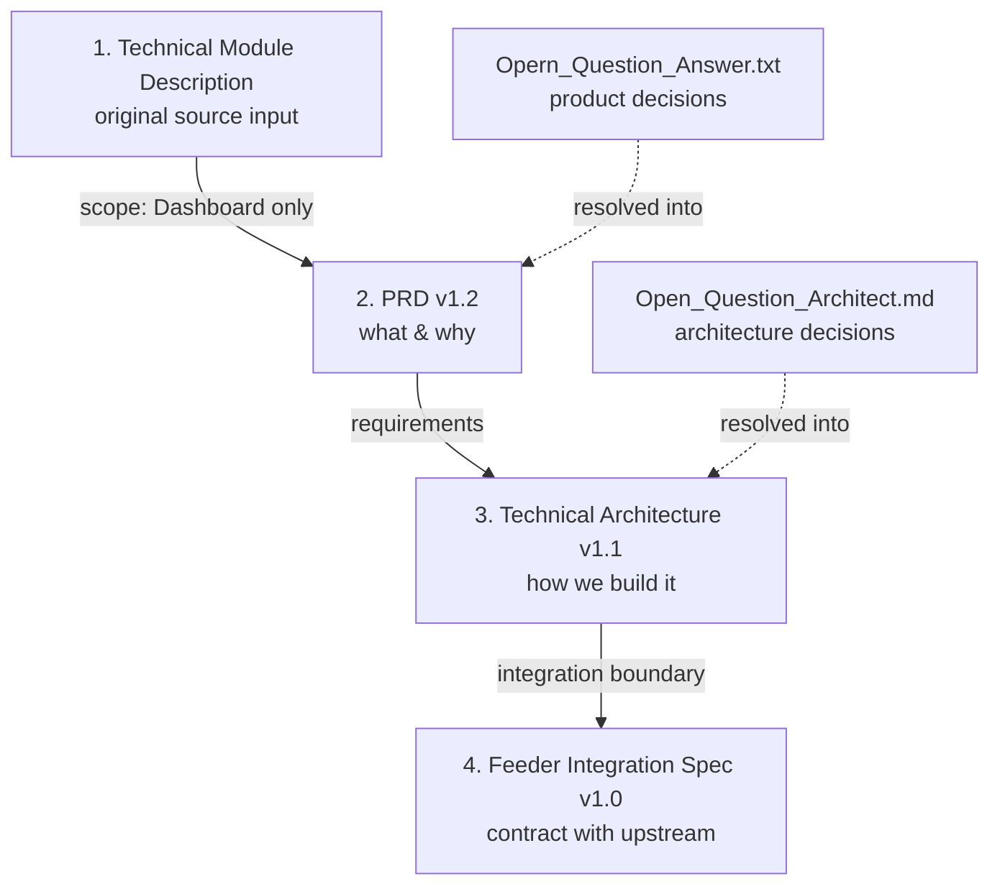

# Fire Alarm Monitoring Dashboard — Documentation Index

This folder holds the product and technical documentation for the **Fire Alarm Monitoring Dashboard** — a read-only, real-time web dashboard that visualizes Fire Alarm Control Panel (FACP), zone, and device status. It consumes data from the upstream **Modbus Database Feeder Service** via PostgreSQL (read-only) and `LISTEN/NOTIFY`; it **never talks to Modbus hardware** and is **not** responsible for building the Feeder.

---

## Documents

| # | Document | What it is | Owner | Status / Version |
|---|---|---|---|---|
| 1 | [Fire_Alarm_Modbus_Technical_Module_Description.md](./Fire_Alarm_Modbus_Technical_Module_Description.md) | **Source input.** Original technical module description covering both the Feeder Service (out of scope for us) and the Dashboard (§2). | Upstream author | Reference |
| 2 | [PRD_Fire_Alarm_Monitoring_Dashboard.md](./PRD_Fire_Alarm_Monitoring_Dashboard.md) | **Product Requirements.** Overview, problems, solution, scope, user roles, user stories, acceptance criteria, scenario use cases, success metrics. | Product Management | v1.2 — Reviewed |
| 3 | [Technical_Architecture.md](./Technical_Architecture.md) | **Technical Architecture.** Tech stack, high-level architecture, folder structure, DB design, API design, auth flow, security, deployment, infrastructure, ADRs. | System Architecture | v2.0 — Next.js 16 full-stack |
| 4 | [Feeder_Integration_Spec.md](./Feeder_Integration_Spec.md) | **Integration contract** for the Feeder team: domain-table schema, read-only DB role, `LISTEN/NOTIFY` payload, commit-ordering, reconciliation. | System Architecture | v1.0 — Contract |

### Supporting / decision records
| Document | What it is |
|---|---|
| [Opern_Question_Answer.txt](./Opern_Question_Answer.txt) | Stakeholder answers to the PRD's open questions (scale, export formats, retention, notifications, roles). Folded into PRD v1.2. |
| [Open_Question_Architect.md](./Open_Question_Architect.md) | Architecture decisions: PostgreSQL-only (`LISTEN/NOTIFY`, no Redis) + DB access boundary. Folded into Technical Architecture v1.1. |

---

## How the documents relate

---

## Reading order by audience

- **New to the project** → 2 (PRD) → 3 (Architecture) → 4 (Integration Spec).
- **Product / stakeholders** → 2 (PRD), especially Scope, User Stories, Acceptance Criteria, Scenario Use Cases.
- **Dashboard engineers** → 3 (Architecture) → 4 (Integration Spec) → 2 (PRD acceptance criteria).
- **Feeder team** → 4 (Integration Spec) — the checklist in §9 is the deliverable list.

---

## Key facts at a glance

| Aspect | Decision | Source |
|---|---|---|
| Product type | Read-only, real-time monitoring web app | PRD §1 |
| Explicitly out of scope | Modbus Feeder Service; hardware control; external notifications | PRD §7.2 |
| Scale target | 100 panels / ~20,000 devices | PRD §7.3 |
| History retention | 5 years (dashboard queries recent 30–90 days) | PRD §7.3 |
| Notifications | In-app only (toast, audible, badge) via SSE | PRD §7.1 |
| Roles | Administrator, Safety Officer, Viewer (read-only v1) | PRD §8 |
| Implementation stack | **Next.js 16 App Router** (React 19, Tailwind v4, TypeScript 5) — one full-stack app; API via Route Handlers | Architecture §1 |
| Feeder ↔ Dashboard link | Shared PostgreSQL (read-only role) + `LISTEN/NOTIFY` — **no Redis/broker in v1** | Architecture §2.1, Spec §5 |
| Real-time to browser | Server-Sent Events (SSE) via Route Handler + `instrumentation` `LISTEN` | Architecture §5.4, §2 |
| Read-only enforcement | `dashboard_ro` PostgreSQL role — SELECT-only on domain tables | Spec §4 |

---

## Open items

- **Final Role → Permission Matrix** to be confirmed with the Safety Team during detailed design (PRD §14).
- **Event enum vs. generic event value** in the `NOTIFY` payload to be confirmed at Feeder implementation kickoff (Spec §5.3).

---

*Index last updated: 2026-07-12*
