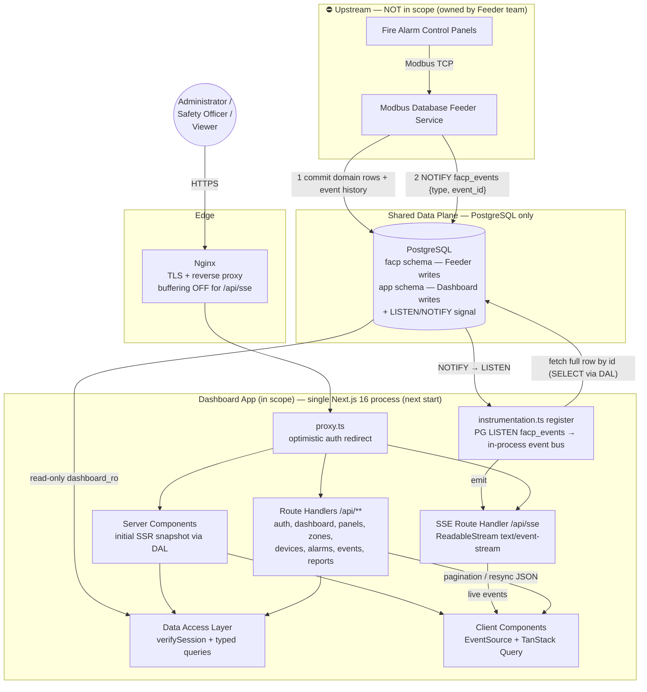
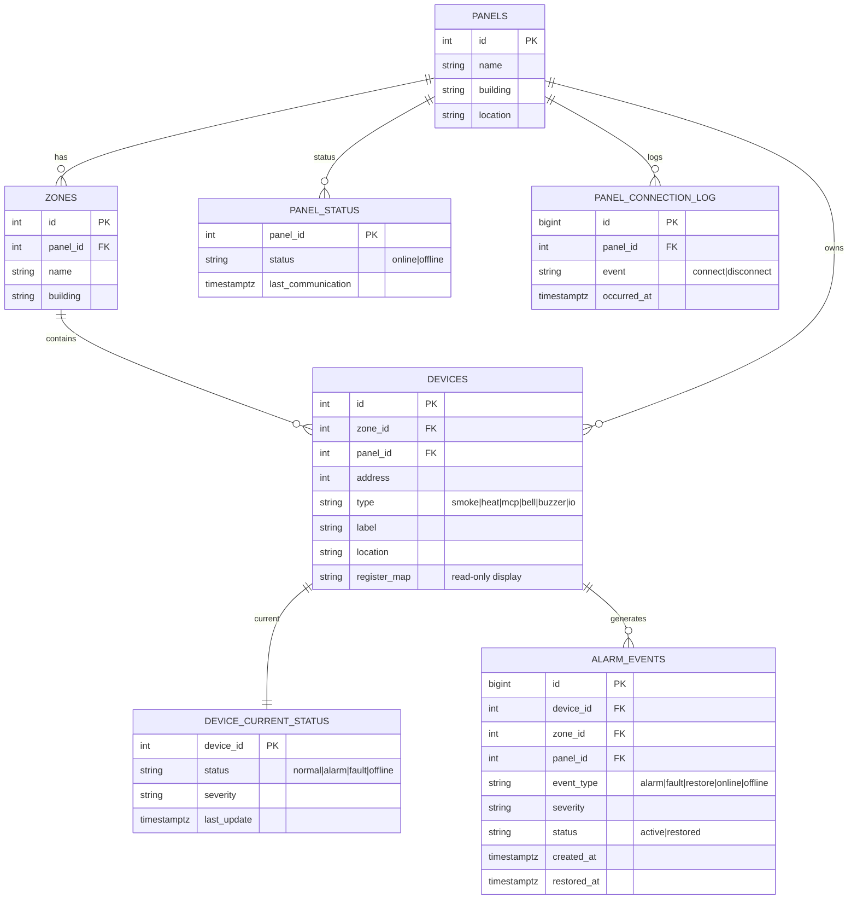
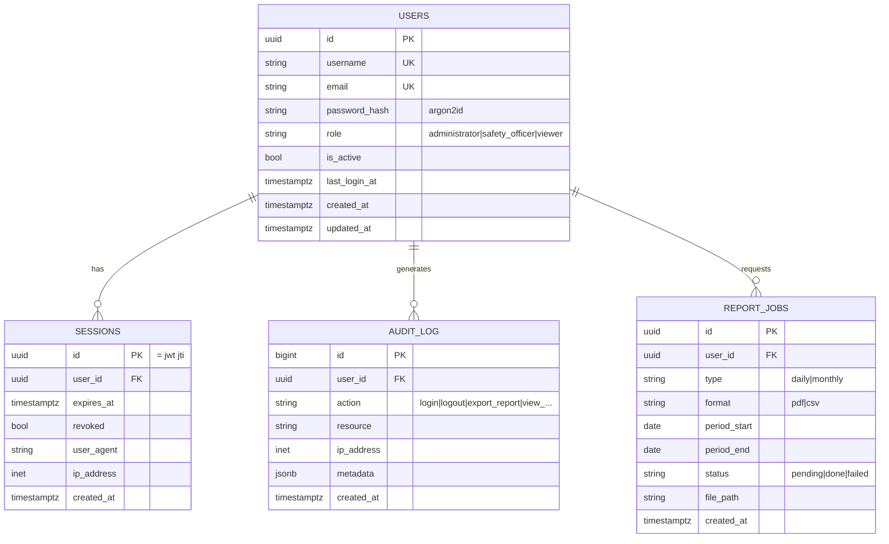
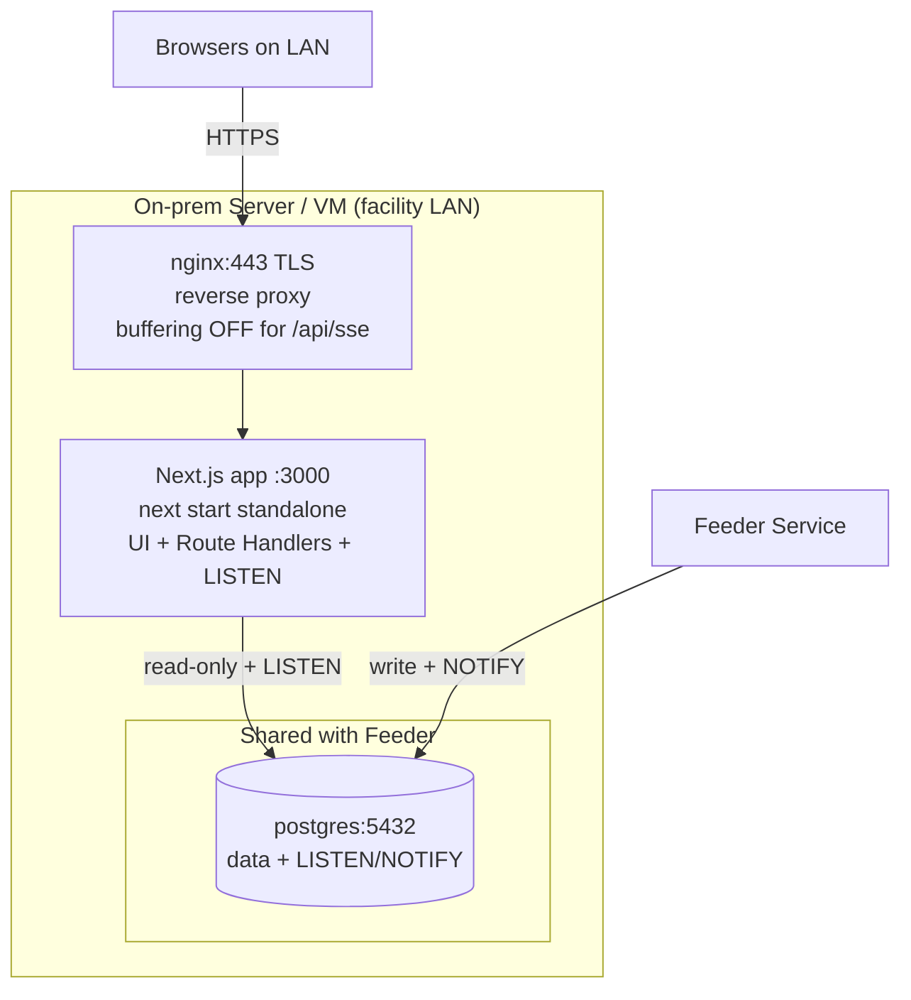
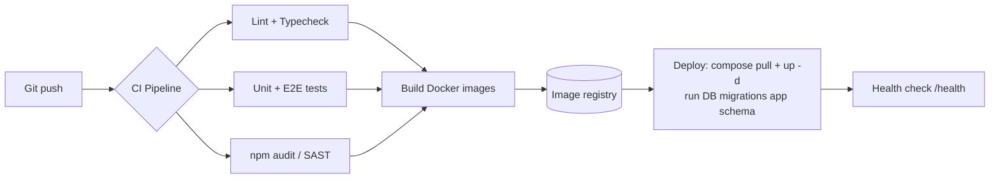

# Technical Architecture
## Fire Alarm Monitoring Dashboard

| Field | Value |
|---|---|
| **Document Owner** | System Architecture |
| **Version** | 2.0 |
| **Last Updated** | 2026-07-12 |
| **Status** | Updated to match implementation stack — **Next.js 16 full-stack (App Router)** |
| **Source** | `docs/PRD_Fire_Alarm_Monitoring_Dashboard.md` (v1.2), `docs/Open_Question_Architect.md`, `dashboard-app/` (actual project) |
| **Scope** | Dashboard app only (one full-stack deployable). **Modbus Feeder Service is upstream and NOT built here.** |

> **v2.0 change log:** The scaffolded project (`dashboard-app/`) is a **single Next.js 16 App Router application** (React 19, Tailwind v4, TypeScript 5) — not the earlier "React SPA + separate NestJS API" split. This document is updated so the architecture matches the code: **one full-stack Next.js deployable** where the backend is implemented with **Route Handlers + Server Components**, not a standalone Nest service. All PRD-derived and PostgreSQL-only (`LISTEN/NOTIFY`, no Redis) decisions from v1.1 are unchanged.

---

## 0. Architectural Principles & Constraints (from PRD)

These are the non-negotiable guardrails every design decision below respects:

1. **Read-only.** The dashboard never writes to hardware and never writes to the domain tables (panels, zones, devices, alarms). v1 has **no control actions** (no acknowledge/reset/silence).
2. **No Modbus.** The dashboard never talks to Modbus. It only consumes **processed** data via REST (snapshot) and **SSE** (live deltas).
3. **Integration boundary.** The upstream **Modbus Feeder Service** owns the domain database tables and the source of real-time events. Our backend is a **read layer + event relay + auth/reporting layer** on top.
4. **PostgreSQL-only, no message broker (v1).** Per the resolved architecture decision, **PostgreSQL is both the source of truth and the real-time signal** (via `LISTEN/NOTIFY`). **No Redis / no external broker in v1** — this keeps infrastructure minimal. A broker may be introduced later if event volume or consumer count grows.
5. **Simple & scalable.** Up to **100 panels / ~20,000 devices**, **5-year** history retention, server-side pagination, virtualization > 500 rows.
6. **On-prem friendly.** Facility LAN deployment must work without cloud dependencies.

> **Key design consequence:** We own **auth, API, SSE relay, reporting**, and our **own app tables** (users, roles/permissions, settings, sessions, audit) — all inside **one Next.js app**. We do **not** own or migrate the Feeder's domain tables — we connect to them with a **read-only database role (`dashboard_ro`)**, enforced at the PostgreSQL permission level (not just in code).

7. **Full-stack in one process (Next.js).** Frontend and backend live in the same Next.js App Router project. Server-side logic runs as **Route Handlers** (`app/api/**/route.ts`) and **Server Components**; the browser layer is **React 19** Client Components. This requires the **Node.js server runtime** (`next start`) — not edge/serverless — because we hold a long-lived PostgreSQL `LISTEN` connection and stream SSE.

---

## 1. Tech Stack

### 1.1 Summary

Bold = present in `dashboard-app/package.json` today. Others are additions we will install as the app is built.

| Layer | Choice | Why |
|---|---|---|
| **Framework (full-stack)** | **Next.js 16.2 (App Router)** ✅ | One deployable for UI + API; Server Components for fast first paint, Route Handlers for the API, streaming for SSE |
| **UI library** | **React 19.2** ✅ | Server + Client Components; matches Next 16 (App Router ships its own React) |
| **Language** | **TypeScript 5 (strict)** ✅ | `tsconfig` has `strict: true`, path alias `@/*` |
| **Styling** | **Tailwind CSS v4** ✅ (via `@tailwindcss/postcss`) | CSS-first config (no `tailwind.config.js`); fast, consistent, glanceable UI |
| **Lint** | **ESLint 9 flat config** ✅ (`eslint.config.mjs`, `eslint-config-next`) | v16 uses flat config; `next lint` is removed |
| **Bundler/dev** | **Turbopack** ✅ (Next 16 default for `dev` and `build`) | Default in v16; no config needed |
| **UI components** | **shadcn/ui + Radix** (to add) | Accessible primitives; simple status tiles/tables/toasts |
| **Server state (client)** | **TanStack Query** (to add) | Client-side caching, pagination, refetch/resync on reconnect |
| **Client state** | **Zustand** (to add) | Small global store: SSE status, notification/mute state |
| **Realtime client** | Native **`EventSource` (SSE)** | Auto-reconnect built-in; matches PRD; simpler than WebSocket |
| **Charts** | **Recharts** (to add) | Report/dashboard statistics |
| **List virtualization** | **TanStack Virtual** (to add) | Smooth >500-row tables (PRD §7.3) |
| **API layer** | **Next.js Route Handlers** (`app/api/**/route.ts`) | Web `Request`/`Response`; replaces the standalone NestJS service |
| **Background listener** | **`instrumentation.ts` `register()`** | Runs once at server start — opens the PG `LISTEN` connection + in-process event bus |
| **DB access** | **Prisma** (app schema) + **raw parameterized SQL / Kysely** (read-only domain tables) | Prisma migrations for our tables; typed raw reads for tables we must not migrate |
| **Database** | **PostgreSQL 15** | Shared with Feeder; source of truth **and** real-time signal (`LISTEN/NOTIFY`); indexing + partitioning for 5-yr history |
| **Real-time signal** | **PostgreSQL `LISTEN/NOTIFY`** (channel `facp_events`) | No broker needed in v1; each app instance `LISTEN`s and fans out to its own SSE clients |
| **Cache / rate-limit** | **In-process (per-instance) cache + limiter** | Avoids Redis in v1; short-TTL summary cache and login throttle live in memory |
| **Auth / sessions** | **JWT session cookie** via **`jose`** + **Argon2id** hashing; Next `cookies()` API | Stateless, edge-compatible verify; `HttpOnly` cookie; strong password hashing |
| **PDF reports** | **Puppeteer** (HTML→PDF) or **PDFKit** (to add) | Printable audit reports |
| **CSV reports** | Streamed via a Route Handler `ReadableStream` | Large exports without loading all rows into memory |
| **Validation** | **Zod** (to add) | Validate query params / bodies in Route Handlers + a server-side DTO layer |
| **Reverse proxy / TLS** | **Nginx** | TLS termination; **must disable buffering** for SSE (`X-Accel-Buffering: no`) |
| **Containerization** | **Docker** (Next `output: 'standalone'`) + **Docker Compose** | Single on-prem image; portable to K8s later |
| **Observability** | **Pino** logs + `instrumentation` (OTel) + optional Prometheus/Grafana | Health, latency, SSE-connection metrics |
| **Testing** | **Vitest + Playwright** (to add) | Unit + E2E (login, alarm-arrives, resync) |

### 1.2 Why Next.js full-stack + SSE via Route Handler (not a separate NestJS service)

- **The project is already a single Next.js 16 app.** Next.js is a full-stack React framework: the same deployable serves the UI (Server + Client Components) **and** the HTTP API (Route Handlers). A separate NestJS backend would be redundant, add a second deploy target, and duplicate auth/DB code.
- **SSE fits Route Handlers cleanly.** A `GET` Route Handler returns a `ReadableStream` with `Content-Type: text/event-stream` — the documented v16 pattern for Server-Sent Events. SSE is one-directional (server→client), auto-reconnecting, HTTP-friendly through Nginx, and needs no extra protocol — ideal for a **read-only** dashboard. (WebSockets would add bidirectional complexity we don't need.)
- **Fast first paint via Server Components.** The initial dashboard snapshot can be rendered **server-side** by a Server Component reading the DAL directly (no client round-trip), then a Client Component subscribes to `/api/sse` for live deltas. This directly serves the PRD "glanceable in 5 seconds" goal.
- **One caveat drives deployment:** holding a persistent `LISTEN` connection + streaming SSE requires the **long-running Node server** (`next start`), so we self-host the Node runtime — not a serverless/edge target.

### 1.3 Next.js 16 conventions this design depends on

| v16 fact | Impact on our design |
|---|---|
| **Async Request APIs** (`await cookies()`, `await headers()`, `await params`) | Session read/write and route params are `await`ed in handlers and the DAL |
| **`middleware.ts` → `proxy.ts`** | Optimistic auth redirect lives in `proxy.ts` (root), not `middleware.ts` |
| **Route Handlers not cached by default** | Our data routes are dynamic by nature; SSE route sets `export const dynamic = 'force-dynamic'` + `runtime = 'nodejs'` |
| **Turbopack default** (dev + build) | No custom bundler config needed |
| **`instrumentation.ts` `register()` runs once per server start** | The single place to boot the PG `LISTEN` subscriber + in-process event emitter |
| **Streaming needs un-buffered proxies** | Nginx `X-Accel-Buffering: no` / `proxy_buffering off` for `/api/sse` |
| **`next lint` removed; ESLint flat config** | CI runs `eslint` directly |

---

## 2. High-Level Architecture



### 2.1 Integration Contract with the Feeder (the one thing to agree on)

The Feeder is out of scope, but the dashboard depends on **two integration points** over the **shared PostgreSQL only** (no broker):

| Integration | Mechanism | Contract |
|---|---|---|
| **Domain data** | Shared PostgreSQL, **read-only** (`dashboard_ro`) | Table/column schema of `panels`, `zones`, `devices`, `device_current_status`, `alarm_events`, `panel_status`, `panel_connection_log`, and Modbus mapping data |
| **Real-time signal** | PostgreSQL **`LISTEN/NOTIFY`** on channel **`facp_events`** | Feeder issues `NOTIFY facp_events, '<payload>'` **after committing** the transaction. Payload is **small** — event type + id only. |

**Notify payload contract (small by design):**
```json
{ "event": "alarm.created", "event_id": "evt-123" }
```

**How it works (and why it's robust):**
- PostgreSQL is the **permanent source of truth**. `LISTEN/NOTIFY` is used **only as a lightweight real-time signal**, never as a durable queue.
- The Feeder **must `NOTIFY` only after the related DB transaction commits**, so the row is always readable when the backend reacts.
- On receiving a notification, the SSE gateway **fetches the full event row by id** (`SELECT`) and relays it to browsers — the payload stays tiny, and the data is always authoritative.
- **Reconciliation on listener loss:** if the backend's `LISTEN` connection drops, on reconnect it **queries all events created after its last successfully processed event id/timestamp** and replays them, so no event is missed despite `NOTIFY` being non-durable.
- **Horizontal scaling still works without a broker:** every backend instance opens its own `LISTEN` connection and fans out to the browsers connected to it. (A broker like Redis may be added later only if event volume/consumer count demands it.)

### 2.2 Data Flow (runtime)

```mermaid
sequenceDiagram
    participant B as Browser (React 19)
    participant N as Nginx
    participant APP as Next.js app (SSR + Route Handlers)
    participant I as instrumentation LISTEN bus
    participant PG as PostgreSQL
    participant F as Feeder (upstream)

    Note over APP,PG: 0) Server boot — instrumentation.register()
    APP->>I: start
    I->>PG: LISTEN facp_events (persistent connection)

    Note over B,PG: 1) Initial snapshot (Server Component SSR)
    B->>N: GET / (session cookie)
    N->>APP: proxy (proxy.ts optimistic auth check)
    APP->>PG: DAL reads summary (in-process cache 2s TTL)
    APP-->>B: server-rendered dashboard HTML

    Note over B,APP: 2) Live subscription (Client Component)
    B->>N: GET /api/sse (session cookie)
    N->>APP: proxy (buffering off)
    APP->>I: subscribe (in-process emitter)

    Note over F,PG: 3) Change happens upstream
    F->>PG: BEGIN; UPDATE status; INSERT alarm_events; COMMIT
    F->>PG: NOTIFY facp_events {"event":"alarm.created","event_id":"evt-123"}
    PG-->>I: notification (type + id)
    I->>PG: SELECT full event row by id (DAL)
    I-->>APP: emit event
    APP-->>B: SSE: event: alarm.created (full data)

    Note over B: 4) UI updates counters,<br/>list, toast, sound, badge

    Note over I,PG: On LISTEN drop → reconnect →<br/>SELECT events after last processed id (reconcile)
```

---

## 3. Folder Structure

Single **Next.js 16 App Router** project (`dashboard-app/`). The existing scaffold (`app/layout.tsx`, `app/page.tsx`, `app/globals.css`, `next.config.ts`, `eslint.config.mjs`, `postcss.config.mjs`) is extended as below. Routes use **Route Groups** — `(auth)` for the public login and `(dashboard)` for the protected shell.

```text
dashboard-app/
├── next.config.ts                     # output: 'standalone', headers() for SSE (X-Accel-Buffering: no)
├── postcss.config.mjs                 # Tailwind v4  (present)
├── eslint.config.mjs                  # ESLint 9 flat config  (present)
├── tsconfig.json                      # strict, @/* path alias  (present)
├── instrumentation.ts                 # register(): boot PG LISTEN facp_events + event bus
├── proxy.ts                           # (v16 rename of middleware) optimistic auth redirect
├── prisma/
│   ├── schema.prisma                  # APP schema only (users, sessions, audit, settings)
│   └── migrations/
├── public/                            # static assets (alarm sound, favicon)  (present)
└── app/
    ├── layout.tsx                     # root layout  (present)
    ├── globals.css                    # Tailwind v4 entry  (present)
    ├── (auth)/
    │   └── login/page.tsx             # login screen (Client Component)
    ├── (dashboard)/
    │   ├── layout.tsx                 # protected shell: nav, notification bell, SSE provider
    │   ├── page.tsx                   # Dashboard Summary (Server Component SSR + client counters)
    │   ├── panels/page.tsx
    │   ├── zones/page.tsx
    │   ├── devices/
    │   │   ├── page.tsx               # list (virtualized)
    │   │   └── [id]/page.tsx          # device detail
    │   ├── alarms/page.tsx
    │   ├── events/page.tsx            # history + filters
    │   ├── reports/page.tsx
    │   └── admin/users/page.tsx       # user management (Admin only)
    └── api/
        ├── auth/
        │   ├── login/route.ts         # POST — verify creds, set session cookie
        │   ├── logout/route.ts        # POST — clear/revoke session
        │   └── me/route.ts            # GET — current user + role
        ├── dashboard/route.ts         # GET summary (for client resync)
        ├── panels/route.ts            #  + panels/[id]/route.ts
        ├── zones/route.ts             #  + zones/[id]/route.ts
        ├── devices/route.ts           #  + devices/[id]/route.ts, devices/[id]/history/route.ts
        ├── alarms/route.ts
        ├── events/route.ts
        ├── reports/
        │   ├── daily/route.ts         # PDF/CSV (streamed)
        │   ├── monthly/route.ts
        │   └── statistics/route.ts
        ├── sse/route.ts               # GET text/event-stream (nodejs runtime, force-dynamic)
        └── health/route.ts            # DB + LISTEN + feeder-freshness

  src-equivalent libraries (imported via @/lib, @/components):
  ├── lib/
  │   ├── db/                          # Prisma client (app) + Kysely/raw reader (dashboard_ro)
  │   ├── dal/                         # Data Access Layer: verifySession + typed domain queries + DTOs
  │   ├── auth/                        # session.ts (jose encrypt/decrypt), password (argon2), rbac
  │   ├── realtime/                    # LISTEN subscriber, in-process emitter, reconciliation
  │   ├── sse/                         # event-stream helpers (encode, heartbeat, retry)
  │   └── validation/                  # Zod schemas (query params, pagination)
  ├── components/                      # StatusTile, StatusBadge, DataTable, Toast, AlarmSound...
  └── hooks/                           # useSSE, useNotifications, usePagination
```

> **Note on `route.ts` vs `page.ts`:** a `route.ts` and a `page.tsx` cannot coexist at the same segment — that's why the API lives under `app/api/**` while UI lives under the route groups.

---

## 4. Database Design

### 4.1 Ownership model

PostgreSQL is **shared**. To keep the read-only guarantee enforceable, we separate by **schema and DB role**:

- **`facp` schema** (or `public`) — **owned by the Feeder**. Dashboard connects with role `dashboard_ro` (SELECT only). We **never** migrate these tables; we treat their schema as an external contract.
- **`app` schema** — **owned by the Dashboard**. Prisma migrations manage only this schema. Role `dashboard_rw` (SELECT/INSERT/UPDATE on `app.*`).

```sql
-- read-only role for domain tables
GRANT USAGE ON SCHEMA facp TO dashboard_ro;
GRANT SELECT ON ALL TABLES IN SCHEMA facp TO dashboard_ro;
-- read/write only within our own schema
GRANT USAGE, CREATE ON SCHEMA app TO dashboard_rw;
```

### 4.2 Domain tables (owned upstream — read-only contract)



**Read-optimization we request from / coordinate with the Feeder team (indexes on their tables):**

```sql
-- Event history queries (filters + reverse-chronological)
CREATE INDEX idx_alarm_events_created_at   ON facp.alarm_events (created_at DESC);
CREATE INDEX idx_alarm_events_filters      ON facp.alarm_events (panel_id, zone_id, device_id, severity, event_type);
CREATE INDEX idx_alarm_events_active       ON facp.alarm_events (status) WHERE status = 'active';
CREATE INDEX idx_device_status_status      ON facp.device_current_status (status);
```

**5-year retention (partitioning).** `alarm_events` is the only high-growth table. Recommend **range partitioning by month** so dashboard queries hit recent partitions (30–90 day window) fast, while old partitions remain for audit/report:

```sql
-- (owned by Feeder team; documented here as a dependency)
CREATE TABLE facp.alarm_events (...) PARTITION BY RANGE (created_at);
-- monthly partitions alarm_events_2026_07, ... retained 60 months
```

### 4.3 Application tables (owned by Dashboard — `app` schema)



- **`users.role`** is a constrained enum of the three PRD roles. (If the Safety Team later wants granular permissions, promote to `roles`/`permissions` tables in the same `app` schema — no domain-table impact.)
- **`sessions`** is **optional in v1**: the `jose`-signed `HttpOnly` cookie is self-contained (stateless), so no server-side row is strictly required. The table exists only if we want **explicit server-side revocation** (`revoked` flag checked in `verifySession()`); otherwise logout just clears the cookie and `users.is_active` gates disabled accounts.
- **`audit_log`** records security-relevant actions (logins, failed logins, report exports, admin changes) — needed for a safety system.
- **`app_settings`** (key/value or JSONB) — application-level settings (e.g., notification sound on/off default, session lifetime).
- **`report_jobs`** optional: only needed if reports are generated asynchronously (large monthly exports).

> Per the **Database Access Boundary** decision, all of the above live in the **`app` schema** and are the **only** things the dashboard may write. Everything Feeder-generated (panel status, device state, alarm/fault/event history, Modbus mapping) is **SELECT-only**.

---

## 5. API Design

> **Two ways data reaches the UI in Next.js:**
> 1. **Server Components** call the **DAL directly** (no HTTP) to render the initial page server-side — used for first paint of each screen.
> 2. **Route Handlers** under `app/api/**` expose JSON/stream endpoints — used by **Client Components** for live SSE, pagination, filtering, resync, and report downloads.
> The endpoints below are the Route Handler surface (case 2).

### 5.1 Conventions

- Base path: **`/api`** (implemented as `app/api/**/route.ts`). Optional versioning via a route group `app/api/v1/**` if needed later. All responses JSON (except SSE/report streams). Timestamps ISO-8601 UTC.
- **Auth:** the **session is an `HttpOnly` cookie** (not a bearer header) — set at login, read via Next's `cookies()` API and verified in the DAL/`proxy.ts`. (Bearer is not used because the browser can't attach headers to `EventSource`/navigations.)
- **Pagination:** `?page=1&pageSize=50` (default 50, max 200). Response envelope:

```json
{
  "data": [ ... ],
  "meta": { "page": 1, "pageSize": 50, "total": 20000, "totalPages": 400 }
}
```

- **Errors:** consistent shape `{ "error": { "code": "UNAUTHORIZED", "message": "...", "traceId": "..." } }`.
- **Filtering:** documented per endpoint; unknown params rejected (400).

### 5.2 Endpoints

| Method | Path (`app/api/...`) | Roles | Purpose |
|---|---|---|---|
| `POST` | `/api/auth/login` | public | Verify credentials → set session cookie |
| `POST` | `/api/auth/logout` | any | Clear/revoke session |
| `GET`  | `/api/auth/me` | any | Current user + role |
| `GET`  | `/api/dashboard` | any | Summary counters + last update (client resync) |
| `GET`  | `/api/panels` | any | Panel list + status (paginated) |
| `GET`  | `/api/panels/[id]` | any | Single panel detail + zones |
| `GET`  | `/api/zones` | any | Zone list + status (filter by panel) |
| `GET`  | `/api/zones/[id]` | any | Zone detail + devices |
| `GET`  | `/api/devices` | any | Device list (filter: status, type, zone, panel, search; paginated) |
| `GET`  | `/api/devices/[id]` | any | Device detail (info, status, register map, last comm) |
| `GET`  | `/api/devices/[id]/history` | any | Alarm history for a device |
| `GET`  | `/api/alarms` | any | Active alarms (paginated, sorted severity/time) |
| `GET`  | `/api/events` | any | Event history + filters (date, panel, zone, device, severity, type) |
| `GET`  | `/api/reports/daily` | Admin, Safety Officer | Daily report (`?date=&format=pdf\|csv`) — streamed |
| `GET`  | `/api/reports/monthly` | Admin, Safety Officer | Monthly report (`?month=&format=pdf\|csv`) — streamed |
| `GET`  | `/api/reports/statistics` | Admin, Safety Officer | Alarm/fault/device stats (for charts) |
| `GET`  | `/api/sse` | any (session) | **SSE stream** of live events (`nodejs` runtime, `force-dynamic`) |
| `GET`  | `/api/health` | public | Liveness/readiness (DB, `LISTEN` alive, Feeder freshness) |
| `GET`/`POST`/`PATCH`/`DELETE` | `/api/users` , `/api/users/[id]` | **Admin only** | User management |

> **No refresh-token endpoint:** with a stateless `jose`-signed session cookie (sliding expiry, refreshed on activity), a separate `/auth/refresh` route is not required in v1. Session lifetime/rotation is handled in the DAL when the cookie is read.

> **Role mapping to PRD:** all three roles get read/monitoring endpoints; **reports** are limited to Administrator + Safety Officer (Viewer per PRD has read-only dashboard/report *view*, so report **view** is allowed for Viewer too — confirm with Safety Team; **user management is Admin-only**). RBAC is enforced **server-side in every Route Handler and Server Component via the DAL**, never by hiding UI alone.

### 5.3 Representative payloads

**`GET /api/dashboard`**
```json
{
  "panelsOnline": 98,
  "panelsOffline": 2,
  "activeAlarms": 1,
  "activeFaults": 3,
  "activeDevices": 19850,
  "lastUpdate": "2026-07-12T09:31:04Z"
}
```

**`GET /api/alarms?page=1&pageSize=50`**
```json
{
  "data": [
    {
      "id": 88213,
      "timestamp": "2026-07-12T09:30:59Z",
      "panel": "Panel A",
      "zone": "Warehouse A",
      "device": "Smoke Detector 15",
      "deviceType": "smoke",
      "severity": "critical",
      "status": "active"
    }
  ],
  "meta": { "page": 1, "pageSize": 50, "total": 1, "totalPages": 1 }
}
```

### 5.4 SSE contract

**Endpoint:** `GET /api/sse` — a Route Handler (`app/api/sse/route.ts`) with `export const runtime = 'nodejs'` and `export const dynamic = 'force-dynamic'`, returning a `ReadableStream` with `Content-Type: text/event-stream`. Session-cookie authenticated; the handler subscribes to the in-process emitter fed by `instrumentation.ts`. Server emits named events:

```text
event: alarm.created
data: {"device":"Smoke Detector 15","deviceId":15,"panel":"Panel A","zone":"Warehouse A","severity":"critical","timestamp":"2026-07-12T09:30:59Z"}

event: alarm.restored
data: {...}

event: device.status_changed
data: {"deviceId":15,"status":"fault","severity":"minor"}

event: panel.status_changed
data: {"panelId":3,"status":"offline","lastCommunication":"..."}

event: summary.updated
data: {"panelsOnline":98,"activeAlarms":1,...}

: heartbeat        (comment ping every 15s to keep connection alive through Nginx)
```

- The backend also sends a `retry: 5000` directive; the browser `EventSource` auto-reconnects.
- On (re)connect the frontend **re-fetches `GET /dashboard` and active lists** to resync (PRD AC-I2), then trusts the stream.
- The SSE gateway builds each event by **`SELECT`-ing the full row** (by the id from the `facp_events` `NOTIFY`, §2.1) — the browser payload is rich even though the DB notification is tiny.
- **Two layers of reconciliation:** (a) backend↔PostgreSQL on `LISTEN` drop (query events after last processed id); (b) browser↔backend on `EventSource` drop (re-fetch REST snapshot). Together these guarantee no missed events end-to-end.

---

## 6. Auth Flow

**Model (Next.js stateless session):** on login we verify the password (Argon2id) and set a **single `HttpOnly` session cookie** containing a **`jose`-signed JWT** (`{ sub, role, exp }`, e.g. 7-day sliding expiry). There is no separate access/refresh pair and no bearer header — the cookie *is* the session, which works uniformly for page navigations, Server Components, Route Handlers, and `EventSource`.

**Two-layer authorization (Next.js recommended pattern):**
1. **`proxy.ts` (optimistic check)** — a fast, cookie-presence redirect at the edge of every protected route; cheap, not the security boundary.
2. **Data Access Layer `verifySession()` (authoritative check)** — every Server Component and Route Handler that touches data calls the DAL, which re-verifies the signed cookie and the user's **role** before any query. This is the real enforcement point (deny-by-default).

```mermaid
sequenceDiagram
    participant B as Browser
    participant PX as proxy.ts
    participant RH as Route Handler / Server Component
    participant DAL as DAL (verifySession + rbac)
    participant PG as app schema (users, sessions, audit)

    B->>RH: POST /api/auth/login {username, password}
    RH->>PG: fetch user by username
    RH->>RH: Argon2id verify password
    alt invalid / inactive
        RH-->>B: 401 (generic message)
    else valid
        RH->>RH: jose SignJWT {sub, role, exp}
        RH->>PG: (optional) record session + audit login
        RH-->>B: Set-Cookie: session=<jwt> (HttpOnly, Secure, SameSite=Strict)
    end

    Note over B,PX: Subsequent protected request (page or /api)
    B->>PX: GET /(dashboard)/... or /api/... (cookie)
    PX->>PX: cookie present? else redirect /login (optimistic)
    PX->>RH: forward
    RH->>DAL: verifySession() + requireRole()
    DAL->>DAL: await cookies() → jose jwtVerify → check role
    alt valid + authorized
        DAL->>PG: query (read-only dashboard_ro for domain)
        RH-->>B: 200 data
    else invalid / wrong role
        RH-->>B: 401 / 403 (or redirect)
    end

    B->>RH: POST /api/auth/logout
    RH-->>B: Set-Cookie: session=; Max-Age=0
```

**Placement & v16 specifics:**
- **Session cookie:** `HttpOnly; Secure; SameSite=Strict` — not readable by JS (mitigates XSS token theft) and sent automatically with `EventSource` and navigations, so **SSE needs no query-param token**.
- **Async Request APIs:** the cookie is read with `await cookies()` and route params with `await params` (v16 breaking change).
- **RBAC:** a small `requireRole(session, ...roles)` helper in the DAL; UI additionally hides unauthorized nav, but the DAL is the boundary.
- **Session management (PRD AC-A3/A4):** expired/invalid cookie → `verifySession()` fails → redirect to `/login`. Sliding expiry refreshes the cookie on activity; configurable absolute lifetime.
- **Revocation (v1):** logout clears the cookie. For immediate server-side invalidation (e.g., disabled user) the DAL checks `users.is_active` on `verifySession()`; an optional `sessions` table supports explicit revoke if required later.

---

## 7. Security Considerations

| Area | Control |
|---|---|
| **Transport** | TLS 1.2+ everywhere (Nginx terminates); HSTS header |
| **Passwords** | **Argon2id** hashing; min length + breach-list check on user creation |
| **Session** | `jose`-signed JWT in an **`HttpOnly; Secure; SameSite=Strict` cookie**; `SESSION_SECRET` from env; sliding + absolute expiry |
| **AuthZ boundary** | **DAL `verifySession()` + `requireRole()`** on every Server Component / Route Handler (deny-by-default); `proxy.ts` is only an optimistic pre-check. UI hiding is never the boundary |
| **Data exposure** | **DTO layer** in the DAL — Server Components/handlers return only whitelisted fields (never raw DB rows), matching Next's data-security guidance |
| **Read-only enforcement** | DB role `dashboard_ro` has **SELECT-only** on domain tables — even a code bug cannot write to hardware-backed data |
| **Input validation** | **Zod** on all query params/bodies in Route Handlers; reject unknown fields; clamp `pageSize`; `await params`/`await searchParams` |
| **SQL injection** | Parameterized queries only (Prisma / Kysely); no string concatenation |
| **XSS** | React auto-escaping; **strict CSP** via `next.config.ts` headers (and/or `proxy.ts` nonce); session cookie not readable by JS |
| **CSRF** | `SameSite=Strict` cookie + origin/`same-origin` check on mutating routes (`login`/`logout`/`users`). (Server Actions, if used, carry Next's built-in action-id protection) |
| **CORS** | Same-origin only (UI + API share the Next origin), so no cross-origin API surface by default |
| **Rate limiting** | In-process limiter on `/api/auth/login` (e.g., 5/min/IP) to stop brute force; global API limiter. (Single-node v1; move to a shared store if scaled out) |
| **Security headers** | CSP, HSTS, `X-Frame-Options: DENY`, `X-Content-Type-Options: nosniff` via `next.config.ts` `headers()` |
| **Audit** | `app.audit_log` for logins, failed logins, report exports, user-management actions |
| **Secrets** | `.env` / Docker secrets; never in repo; `SESSION_SECRET` rotated; separate keys per env |
| **SSE abuse** | Per-user connection cap; session-authenticated; heartbeat + idle timeout |
| **Least privilege** | Separate DB roles (`_ro` vs `_rw`); container runs as non-root |
| **Dependency hygiene** | `npm audit`/Dependabot in CI; pinned versions |
| **PII** | Minimal — usernames/emails only; audit logs access-controlled |

---

## 8. Deployment Plan

### 8.1 Topology (on-prem, single node — primary target)

Facility-LAN deployment via **Docker Compose**. All images built in CI, deployed to the on-site server.



**`docker-compose` services:** `nginx`, `app` (single Next.js image), and optionally `postgres`. **No Redis in v1.** The Next.js image is built with **`output: 'standalone'`** and run with **`next start`** (long-running Node server — required for the persistent `LISTEN` and SSE streaming). **PostgreSQL** is typically **managed by the Feeder deployment** (shared); if co-located, add a `postgres` service with a dedicated volume.

**Nginx must not buffer the SSE stream** — set `proxy_buffering off;` for `/api/sse` (and the app sets `X-Accel-Buffering: no` on the SSE response via `next.config.ts` headers), plus a high `proxy_read_timeout`.

**Scaling & the single-listener caveat:** the app can run multiple replicas behind an Nginx `upstream`; **each replica opens its own `LISTEN`** and fans out to its own SSE clients, so no shared broker is needed. Because the `LISTEN` subscriber is booted in `instrumentation.register()` (once per process), every replica stays in sync directly from PostgreSQL.

**Graceful shutdown:** run with `NEXT_MANUAL_SIG_HANDLE=true` and handle `SIGTERM`/`SIGINT` to close the `LISTEN` connection and drain open SSE streams before exit (clients auto-reconnect and resync).

### 8.2 CI/CD



- **Lint:** `eslint` directly (ESLint 9 flat config; `next lint` is removed in v16). **Typecheck:** `tsc --noEmit`. **Build:** `next build` (Turbopack).
- **Migrations:** `prisma migrate deploy` runs only against the **`app`** schema (never touches Feeder tables).
- **Single image:** one Next.js `standalone` image (UI + API together) — no separate frontend/backend artifacts.
- **Zero-downtime-ish:** rolling replace of app replicas; open SSE streams drop and clients auto-reconnect + resync.
- **Rollback:** re-deploy previous image tag; app-schema migrations are additive/backward-compatible.

### 8.3 Environments

| Env | Purpose | Notes |
|---|---|---|
| **Dev** | Local | Compose + seeded Postgres + a mock Feeder that writes rows and issues `NOTIFY facp_events` |
| **Staging** | Pre-prod on facility test LAN | Mirrors prod; connected to a test Feeder/DB |
| **Prod** | Facility LAN | Shared prod Postgres, TLS certs, backups |

> A **mock Feeder** (small script that seeds domain tables and issues `NOTIFY facp_events` on changes) is important so the dashboard can be developed/tested independently of the real Feeder.

---

## 9. Infrastructure Requirements

### 9.1 Compute (single-node baseline for 100 panels / 20k devices)

| Component | Spec (baseline) | Notes |
|---|---|---|
| App server (VM/host) | 4 vCPU, 8–16 GB RAM, 100 GB SSD (OS/app) | Runs Nginx + Next.js app (`next start`); no Redis in v1 |
| PostgreSQL | 4 vCPU, 16 GB RAM | Shared with Feeder; sized by Feeder team; must allow `LISTEN` connections from the app |
| Storage for history | See §9.2 | 5-year `alarm_events` retention |

### 9.2 Storage sizing (history)

Growth is driven by `alarm_events` (state-change events only, not continuous samples). Rough estimate:

- Assume ~20,000 devices, average a few state changes/device/day + panel logs → order of **hundreds of thousands to low millions of rows/year**.
- At ~300–500 bytes/row incl. indexes → **~1–3 GB/year**, i.e. **~5–15 GB for 5 years**.
- Recommend provisioning **≥ 100 GB** with headroom + monthly partition pruning/archival policy. (Confirm real event rates with the Feeder team; this is a monitoring app, so our footprint beyond history is small.)

### 9.3 Network

- Browsers reach Nginx over **HTTPS (443)** on the facility LAN.
- Next.js app ↔ PostgreSQL (5432) on a private network / same host — includes one persistent `LISTEN` connection per app instance.
- **SSE keep-alive:** Nginx `proxy_buffering off;` + response `X-Accel-Buffering: no`, `proxy_read_timeout` high (e.g., 1h), heartbeat every 15s.
- Valid **TLS certificate** (internal CA acceptable for LAN-only).

### 9.4 Availability, Backup, Monitoring

| Concern | Approach |
|---|---|
| **Backups** | PostgreSQL `pg_dump`/PITR daily (owned with Feeder team since DB shared). No broker to back up in v1; the `app` schema (users/audit/settings) is included in the DB backup |
| **Uptime target** | ≥ 99% (PRD) — single node acceptable for v1; document RTO/RPO |
| **Monitoring** | `/health` endpoint (DB connectivity, **`LISTEN` connection alive**, and **Feeder-freshness**: alert if `lastUpdate` is stale > N seconds); Prometheus metrics: SSE connections, API latency, error rate |
| **Logging** | Structured JSON (Pino), centralized (optional Loki); audit log in DB |
| **Alerting** | Ops alert if the app is down, DB unreachable, `LISTEN` dropped, or event stream stale (indicates Feeder problem) |

### 9.5 Scale path (future, if needed)

- **Introduce Redis (or NATS) as an event bus** only if `LISTEN/NOTIFY` fan-out or consumer count becomes a bottleneck — the listener is already abstracted behind `lib/realtime/`, so this is a localized change.
- Move to **Kubernetes** with N app replicas + HPA (each still `next start` with its own `LISTEN`).
- Read-replica of PostgreSQL for reporting/history queries to isolate heavy exports from live reads.
- CDN in front of Next.js static assets if multi-site.

---

## 10. Key Architecture Decisions (ADR summary)

| # | Decision | Rationale | Trade-off |
|---|---|---|---|
| ADR-1 | **SSE, not WebSocket** | One-way, HTTP-friendly, native reconnect; matches read-only PRD | No client→server push (not needed) |
| ADR-2 | **PostgreSQL `LISTEN/NOTIFY` as the real-time signal (no broker in v1)** | Zero extra infrastructure; PG is already the source of truth; small notify payload + fetch-by-id keeps data authoritative | `NOTIFY` is non-durable → requires reconnect **reconciliation** (query events after last processed id). Broker can be added later |
| ADR-3 | **Read-only DB role for domain tables** | Hard-enforces PRD read-only guarantee | Requires coordinated schema contract with Feeder |
| ADR-4 | **Separate `app` schema for our tables** | Clean ownership; safe migrations | Two-role DB setup |
| ADR-5 | **Single full-stack Next.js 16 app (App Router)** — *matches the scaffolded project*; replaces the earlier React-SPA-+-NestJS split | One deployable, one auth/DB codebase; Server Components for fast SSR + Route Handlers for the API | Requires the long-running Node runtime (`next start`); no edge/serverless for SSE + `LISTEN` |
| ADR-6 | **Stateless `jose` JWT session in an HttpOnly cookie** (no bearer/refresh pair) | Works uniformly for pages, Route Handlers, and `EventSource`; XSS-safe cookie; simple | Immediate revocation needs the optional `sessions` table or `is_active` check |
| ADR-7 | **`instrumentation.register()` hosts the single PG `LISTEN`** + in-process emitter | v16-native once-per-process startup hook; clean fan-out to SSE handlers | Tied to Node server lifecycle; must handle graceful shutdown |
| ADR-8 | **Two-layer authZ: `proxy.ts` optimistic + DAL `verifySession()` authoritative** | Follows Next.js security guidance; real enforcement in the data layer | Two checks to keep consistent |
| ADR-9 | **Monthly partitioning of `alarm_events`** | Fast recent-window queries + 5-yr retention | Partition maintenance (Feeder-owned) |
| ADR-10 | **Docker Compose on-prem first (Next `standalone`)** | Facility LAN, no cloud dependency, single image | Manual scaling until K8s |

---

*End of Technical Architecture — v2.0*
