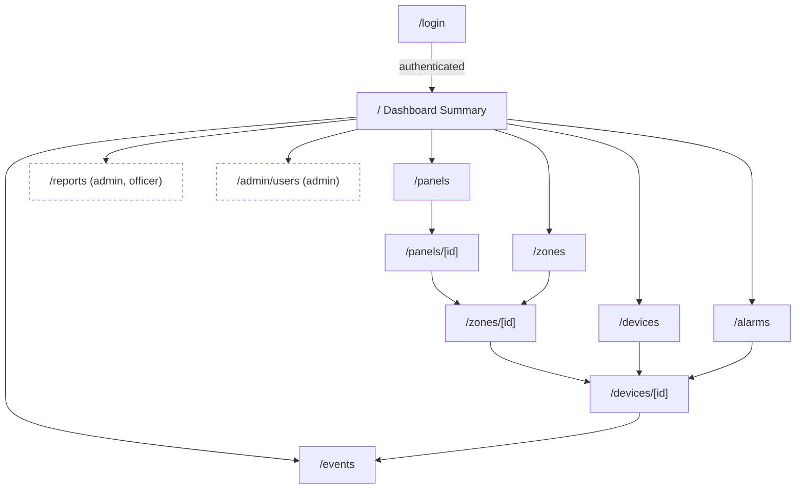

# UI Specification

## Fire Alarm Monitoring Dashboard

| Field | Value |
|---|---|
| **Document Owner** | UI/UX Design |
| **Version** | 1.1 |
| **Last Updated** | 2026-07-13 |
| **Status** | Draft for review · reconciled with shipped implementation (see §12) |
| **Sources** | `docs/PRD_Fire_Alarm_Monitoring_Dashboard.md` (v1.2), `docs/Technical_Architecture.md` (v2.0), `docs/Design_System_Fire_Alarm_Dashboard.md` (v1.0) |
| **Covers** | Sitemap, page structure, component hierarchy, wireframe descriptions |
| **Excludes** | Visual tokens/colors/type (see Design System), backend/API internals (see Technical Architecture) |

> This is a structural blueprint, not code. It defines *what is on each screen, how screens relate, and how components nest*. All colors, type, spacing, status semantics, and accessibility rules are inherited from the Design System and referenced by name (StatusTile, StatusBadge, DataTable, and so on).

---

## 1. How to Read This Document

- **Sitemap (§3):** every route, its access level, and its data source.
- **Global shell (§4):** the persistent frame every protected page renders inside.
- **Page structure (§5):** per page, its regions, data sources (REST snapshot + SSE deltas), states, and interactions.
- **Component hierarchy (§6):** the nesting tree of components per page, using Design System component names.
- **Wireframe descriptions (§7):** ASCII layouts for desktop plus mobile notes.
- **Overlays, flows, responsive, a11y landmarks (§8-§11).**

Two data channels feed every monitoring screen (per Technical Architecture §5):
1. **REST snapshot** on first paint / resync (Server Component or TanStack Query).
2. **SSE deltas** (`alarm.created`, `alarm.restored`, `device.status_changed`, `panel.status_changed`, `summary.updated`) applied live.

Legend used throughout: `[Role]` access, `RSC` = server-rendered first paint, `SSE` = live-updating region, `⌘` = keyboard-reachable action.

---

## 2. Users, Roles, and Access Model

| Role | Sees | Cannot reach |
|---|---|---|
| **Administrator** | All monitoring, reports, event history, **Admin → Users** | nothing (full read scope) |
| **Safety Officer** | All monitoring, reports, event history | Admin → Users |
| **Viewer** | All monitoring, event history, report **view** | Admin → Users; report generation limited pending Safety Team sign-off |

Access is enforced server-side (DAL `requireRole`), and the UI additionally hides nav items a role cannot use. Unauthorized deep links resolve to a **403** page, expired sessions redirect to **/login** (PRD AC-A3/A4, UC-9).

> Open item inherited from PRD §14: the final role/permission matrix (especially Viewer report generation) is confirmed with the Safety Team in detailed design. This spec hides generation controls for Viewer by default and flags it.

---

## 3. Sitemap

### 3.1 Route tree

```
(public)
└─ /login ....................... Login                       [public]

(dashboard shell — protected, wrapped by the app shell in §4)
├─ / ............................ Dashboard Summary            [all]   RSC + SSE
├─ /panels ...................... Panel Monitoring             [all]   RSC + SSE
│   └─ /panels/[id] ............. Panel Detail (its zones)     [all]   RSC + SSE      ◆ new
├─ /zones ....................... Zone Monitoring              [all]   RSC + SSE
│   └─ /zones/[id] .............. Zone Detail (its devices)    [all]   RSC + SSE      ◆ new
├─ /devices ..................... Device Monitoring            [all]   RSC + SSE
│   └─ /devices/[id] ............ Device Detail                [all]   RSC + SSE
├─ /alarms ...................... Alarm Monitoring             [all]   RSC + SSE
├─ /events ...................... Event History                [all]   RSC
├─ /reports ..................... Reports                      [admin, officer] *
└─ /admin
    └─ /users ................... User Management              [admin]

(utility / non-navigational)
├─ 403 .......................... Access Denied (role gate)
├─ 404 .......................... Not Found
└─ /login?expired=1 ............. Session-expiry redirect target
```

`◆ new` = routes not in the original folder scaffold but required by the PRD drill-down (US-D2 / AC-D2 and the "summary → panel → zone → device in ≤3 clicks" metric). Recommended to add as `app/(dashboard)/panels/[id]/page.tsx` and `app/(dashboard)/zones/[id]/page.tsx`.
`*` Reports generation gated to Administrator + Safety Officer; Viewer sees view-only pending Safety Team confirmation.

### 3.2 Sitemap diagram



### 3.3 Global navigation (sidebar order)

Primary nav is a fixed, non-scrolling list. Grouped so the two most time-critical destinations sit at the top:

```
MONITOR
  • Dashboard        /            (home icon)
  • Alarms           /alarms      (triangle icon, live count badge)
  • Panels           /panels
  • Zones            /zones
  • Devices          /devices
REVIEW
  • Event History    /events
  • Reports          /reports     (admin, officer)
ADMIN
  • Users            /admin/users (admin only)
```

Alarms carries the live active-alarm badge in the nav as well as the top-bar bell, so the count is visible whether the sidebar is expanded, collapsed to a rail, or hidden behind the mobile drawer.

---

## 4. Global Application Shell

Every protected route renders inside one persistent shell (`app/(dashboard)/layout.tsx`). The shell mounts the SSE provider once, so navigating between pages never drops the live connection.

### 4.1 Shell regions

```
┌────────────────────────────────────────────────────────────────────┐
│ TopBar (sticky, 56px)                                                │
│  [☰] Breadcrumb / Page title      ⟳Connected  🔇Mute  🔔3  ▾User     │
├───────────┬────────────────────────────────────────────────────────┤
│ Sidebar   │ ReconnectingBanner (conditional, full width)            │
│ (248 / 64)│ ┌────────────────────────────────────────────────────┐ │
│           │ │ Page content (routed)                               │ │
│  MONITOR  │ │                                                     │ │
│  REVIEW   │ │                                                     │ │
│  ADMIN    │ │                                                     │ │
│           │ └────────────────────────────────────────────────────┘ │
└───────────┴────────────────────────────────────────────────────────┘
   Portals (rendered above everything): AlarmToast stack, Modal/Dialog,
   AlarmSound (no visual), aria-live regions
```

### 4.2 Persistent shell components (mounted once, survive route changes)

- **AppSidebar** → NavGroup → NavItem (icon + label + optional badge), CollapseToggle.
- **TopBar** → Breadcrumb, ConnectionStatusPill (SSE), MuteToggle, NotificationBell + AlarmBadge, UserMenu (theme, density, sign out).
- **SSEProvider** (headless) → owns `EventSource`, connection state, and event fan-out to page stores (Zustand + TanStack Query cache).
- **ReconnectingBanner** (conditional) → appears on SSE drop, clears on resync (PRD AC-I1/I2, UC-8).
- **AlarmToastPortal**, **AlarmSoundController** (headless), **DialogPortal**, **LiveRegion** (visually hidden `aria-live`).

### 4.3 Shell behavior contract

- The **Active Alarms count** is a single source (SSE-driven store) rendered in three places: nav Alarms badge, top-bar bell badge, and the Dashboard Active Alarms tile. All update together.
- **Mute** state and **theme/density** preferences live in the client store and persist (localStorage + app settings default).
- On any `alarm.created`, the shell fires: AlarmToast (assertive), AlarmSound (if not muted), badge increment, and a live-region announcement — regardless of which page is open (PRD US-K1).

---

## 5. Page Structure

Each page below lists: **route · access · first-paint · regions · data · states · interactions**.

### 5.1 Login — `/login` · public
- **First paint:** static (Client Component form).
- **Regions:** centered AuthCard (brand mark, title, form, error slot, footer note).
- **Data:** `POST /api/auth/login`.
- **States:** idle, submitting (spinner, inputs locked), error (inline `aria-live`, styled in fault amber, never alarm red), success (redirect to `/`). Expired-session variant shows an informational note when `?expired=1`.
- **Interactions:** submit ⌘Enter; on success land on Dashboard Summary (AC-A1).

### 5.2 Dashboard Summary — `/` · all · RSC + SSE
- **Purpose:** the 5-second glance (PRD North Star, AC-U3).
- **Regions:**
  1. PageHeader (title "Overview", Last Update stamp, density toggle).
  2. **StatusTileGrid** — Panels Online, Panels Offline, Active Alarms (anchor tile), Active Faults, Active Devices.
  3. **Active Alarms preview** — top 5, severity-sorted, "View all" → `/alarms`.
  4. **System overview** — compact zone/panel status matrix (optional second row).
- **Data:** `GET /api/dashboard` (RSC) + `summary.updated`, `alarm.created/restored`, `panel.status_changed` (SSE).
- **States:** loading (tile + list skeletons), all-normal (Active Alarms tile green "0 / All Normal", AC-B3), degraded (stale banner tied to Last Update; the planned per-surface variant is tracked in Design System §16).
- **Anchor tile placement:** the Active Alarms tile renders in the center column on desktop (per the spec tile order) and is reordered **first** on small screens. Its live count is mirrored to a polite screen-reader region so a change is announced even when no toast fires.
- **Interactions:** click any tile → filtered destination (Active Alarms tile → `/alarms`; Offline tile → `/panels?status=offline`); counters tick-flash on change (AC-B2).

### 5.3 Panel Monitoring — `/panels` · all · RSC + SSE
- **Regions:** PageHeader, FilterBar (status online/offline, building/search), PanelGrid or DataTable.
- **Row/card fields:** panel name, building/location, Online/Offline StatusBadge, Last Communication (relative, absolute on hover).
- **Data:** `GET /api/panels` + `panel.status_changed`.
- **States:** loading skeleton, empty ("No panels match"), offline-highlight (offline sorts to top, offline tint, AC-C2/UC-4).
- **Interactions:** row → `/panels/[id]`.

### 5.4 Panel Detail — `/panels/[id]` · all · RSC + SSE  ◆
- **Regions:** Breadcrumb (Panels / {name}), PanelHeader (status, last comm, building), ZoneList (zones under this panel, each a StatusBadge row), ConnectionLog snippet (recent connect/disconnect).
- **Data:** `GET /api/panels/[id]` (+ zones) + SSE.
- **Interactions:** zone row → `/zones/[id]`. Serves drill-down step 2.

### 5.5 Zone Monitoring — `/zones` · all · RSC + SSE
- **Regions:** PageHeader, FilterBar (status, panel), ZoneGrid.
- **Card fields:** zone name, building, single status (Normal/Alarm/Fault/Offline) as StatusBadge (exactly one, AC-D1).
- **Data:** `GET /api/zones` + `device.status_changed` / `alarm.*` aggregated to zone status.
- **States:** loading, empty, alarm-first ordering (alarm zones surface with alarm ring).
- **Interactions:** zone card → `/zones/[id]`.

### 5.6 Zone Detail — `/zones/[id]` · all · RSC + SSE  ◆
- **Regions:** Breadcrumb, ZoneHeader (status), DeviceList scoped to the zone (compact DataTable).
- **Data:** `GET /api/zones/[id]` (+ devices) + SSE.
- **Interactions:** device row → `/devices/[id]` (AC-D2, drill-down step 3).

### 5.7 Device Monitoring — `/devices` · all · RSC + SSE
- **Purpose:** the dense workhorse across ~20,000 devices.
- **Regions:** PageHeader, FilterBar (status, type, panel, zone, text search), DataTable (virtualized > 500 rows), Pagination.
- **Columns:** Status (icon + label), Device (label), Type (glyph + name), Zone, Panel, Location, Severity, Last Update.
- **Data:** `GET /api/devices?filters&page` + `device.status_changed` patches visible rows.
- **States:** loading (row skeletons), empty (filter-aware), large-set (server pagination + virtualization, AC-L1/L2), filtered.
- **Interactions:** filter (URL-synced), row → `/devices/[id]`; filter by status=Fault supports UC-3. Below `md` the table becomes a status-led DeviceCard list. *Planned:* click-to-sort headers and the density toggle (Design System §16).

### 5.8 Device Detail — `/devices/[id]` · all · RSC + SSE
- **Regions (stacked sections):**
  1. DeviceHeader (type glyph, label, current StatusBadge, location).
  2. **Current Status** panel (large status, severity, Last Communication).
  3. **Device Information** (KeyValue list).
  4. **Register Mapping** (read-only, mono, labeled "Reference only", AC-H1).
  5. **Alarm History** (Timeline scoped to this device, `GET /api/devices/[id]/history`).
- **Data:** `GET /api/devices/[id]` + `device.status_changed` for this id.
- **Interactions:** breadcrumb back; history entry → `/events?deviceId=…`.

### 5.9 Alarm Monitoring — `/alarms` · all · RSC + SSE
- **Purpose:** operational heart during an incident (UC-2, UC-10).
- **Regions:** PageHeader (active count, mute), FilterBar (severity, panel, zone), AlarmList (virtualized), Pagination.
- **Row fields:** timestamp, panel, zone, device, SeverityBadge, status.
- **Data:** `GET /api/alarms?sort=severity,time` + `alarm.created` (prepend + highlight) / `alarm.restored` (mark restored / drop).
- **States:** loading, all-clear empty (green "All Normal", never blank), storm (multi-alarm, stable severity-then-time sort).
- **Interactions:** row → `/devices/[id]`; new alarm enters at top with one-shot emphasis (AC-F2).

### 5.10 Event History — `/events` · all · RSC
- **Regions:** PageHeader, FilterBar (date range, panel, zone, device, severity, event type), Timeline grouped by day, Pagination / load-more.
- **Data:** `GET /api/events?filters` (30–90 day default window; explicit range reaches older records, AC-L3). No live prepend (historical view); a subtle "new events available" affordance may refresh.
- **States:** loading, empty (filter-aware), filtered, wide-range (warns on very large ranges).
- **Interactions:** filters URL-synced and shareable (UC-6); timeline entry → related Device Detail.

### 5.11 Reports — `/reports` · admin, officer
- **Regions:** PageHeader, ReportBuilder (type Daily/Monthly, period picker, Generate), StatisticsPanel (StatCards + Recharts), ExportBar (PDF / CSV).
- **Data:** `GET /api/reports/statistics`, `GET /api/reports/daily|monthly?format=`.
- **States:** idle, generating (progress), ready (preview + enabled exports), export-in-progress, error. Viewer (if permitted view-only) sees stats without Generate/Export.
- **Interactions:** generate then export PDF or CSV (AC-J1/J2/J3, UC-7).

### 5.12 User Management — `/admin/users` · admin
- **Regions:** PageHeader (+ "Add User"), UsersDataTable (username, email, role, Status pill, last login), row actions (edit, deactivate), UserFormDialog. Below `md` the table collapses to one card per user; the account state reads as an Active/Inactive status pill under a "Status" column.
- **Data:** `GET/POST/PATCH/DELETE /api/users`.
- **States:** loading, empty, form (create/edit), confirm-destructive (deactivate needs confirmation, never immediate).
- **Interactions:** create/edit in a Dialog; deactivate via ConfirmDialog.

### 5.13 Utility — 403 / 404 / session expiry
- **403:** centered message, plain explanation, "Back to Dashboard" (UC-9).
- **404:** centered, "Back to Dashboard".
- **Expiry:** redirect to `/login?expired=1` with an informational note.

---

## 6. Component Hierarchy

Names map 1:1 to the Design System component library (§9 there). Indentation = composition.

### 6.1 Root and shell

```
RootLayout
├─ ThemeProvider (data-theme, color-scheme)
├─ QueryProvider (TanStack Query)
└─ children
   ├─ (auth) AuthLayout
   │  └─ LoginPage → AuthCard → LoginForm → {FormField ×2, SubmitButton, ErrorRegion}
   └─ (dashboard) DashboardLayout  ← persistent shell
      ├─ SSEProvider (headless: EventSource, store fan-out)
      ├─ AppSidebar
      │  ├─ SidebarHeader (logo, CollapseToggle)
      │  └─ NavGroup ×3 (MONITOR / REVIEW / ADMIN)
      │     └─ NavItem (Icon, Label, AlarmBadge?)   ← role-filtered
      ├─ TopBar
      │  ├─ SidebarTrigger (mobile ☰)
      │  ├─ Breadcrumb
      │  └─ TopBarActions
      │     ├─ ConnectionStatusPill
      │     ├─ MuteToggle
      │     ├─ NotificationBell → AlarmBadge
      │     └─ UserMenu → {ThemeToggle, DensityToggle, SignOut}
      ├─ ReconnectingBanner (conditional)
      ├─ <main> PageOutlet (routed page)
      └─ Portals
         ├─ AlarmToastPortal → AlarmToast[]
         ├─ AlarmSoundController (headless <audio>)
         ├─ DialogPortal
         └─ LiveRegion (aria-live polite + assertive)
```

### 6.2 Shared page primitives

```
PageShell
├─ PageHeader → {Title, LastUpdateStamp?, HeaderActions?}
├─ FilterBar → {StatusFilter, TypeFilter, PanelFilter, ZoneFilter, DateRangePicker, SearchField, ClearFilters}
└─ ContentRegion → { one of: StatusTileGrid | DataTable | CardGrid | Timeline | DetailSections | ReportBuilder }

DataTable
├─ DataTableToolbar (density, column visibility)
├─ DataTableHeader (sortable columns, sticky)
├─ VirtualizedBody → DataRow → {StatusCell(StatusBadge), TextCell, TypeCell(glyph), SeverityBadge, TimeCell(mono)}
├─ EmptyState | LoadingSkeletonRows | ErrorState
└─ Pagination (page size, total)
```

### 6.3 Per-page composition (key pages)

**Dashboard Summary**
```
SummaryPage
├─ PageHeader (LastUpdateStamp)
├─ StatusTileGrid
│  └─ StatusTile ×5  (Active Alarms = AnchorTile: resting→active behavior)
├─ ActiveAlarmsPreview → AlarmMiniRow ×≤5 → ViewAllLink(/alarms)
└─ SystemOverviewMatrix → StatusDot grid (panels/zones)   [optional]
```

**Alarm Monitoring**
```
AlarmsPage
├─ PageHeader (active count, MuteToggle mirror)
├─ FilterBar (severity, panel, zone)
├─ AlarmList (DataTable, virtualized)
│  └─ AlarmRow → {TimeCell, PanelCell, ZoneCell, DeviceCell, SeverityBadge, StatusBadge}
└─ Pagination
```

**Device Detail**
```
DeviceDetailPage
├─ Breadcrumb
├─ DeviceHeader → {TypeGlyph, Label, StatusBadge, LocationText}
├─ CurrentStatusPanel → {StatusBadge(lg), SeverityBadge, LastCommStamp}
├─ DeviceInfoList (KeyValue)
├─ RegisterMappingPanel (mono KeyValue, "Reference only" tag)
└─ DeviceAlarmHistory → Timeline → TimelineEntry[]
```

**Reports**
```
ReportsPage
├─ PageHeader
├─ ReportBuilder → {ReportTypeSelect, PeriodPicker, GenerateButton}
├─ StatisticsPanel → {StatCard ×N, BarChart, LineChart}   (Recharts, dataviz palette)
└─ ExportBar → {ExportPdfButton, ExportCsvButton}
```

**User Management**
```
UsersPage
├─ PageHeader (AddUserButton)
├─ UsersDataTable → UserRow → {UsernameCell, EmailCell, RoleBadge, ActiveToggleReadout, LastLoginCell, RowActions}
├─ UserFormDialog (create/edit)
└─ ConfirmDialog (deactivate)
```

Panels / Zones / Devices monitoring pages all reuse `PageShell → FilterBar → DataTable|CardGrid → Pagination`; only columns/fields and the drill-down target differ.

---

## 7. Wireframe Descriptions

Desktop frames at ~lg (≥1024px). Mobile behavior noted after each. All frames sit inside the shell (§4); only the routed content region is drawn unless the shell is relevant.

### 7.1 Login `/login`

```
┌──────────────────────────── viewport (min-h 100dvh) ─────────────────────────┐
│                                                                               │
│                         ┌───────────────────────────┐                         │
│                         │  ▣  Fire Alarm Monitoring  │                         │
│                         │  Sign in to continue       │                         │
│                         │                            │                         │
│                         │  Username                  │                         │
│                         │  [__________________]      │                         │
│                         │  Password                  │                         │
│                         │  [__________________]      │                         │
│                         │                            │                         │
│                         │  (!) inline error region   │  ← aria-live            │
│                         │                            │                         │
│                         │  [       Sign In       ]   │                         │
│                         │                            │                         │
│                         │  Facility LAN · v1         │                         │
│                         └───────────────────────────┘                         │
│                                                                               │
└───────────────────────────────────────────────────────────────────────────┘
```
Mobile: card goes full-width with 16px gutters; no layout change.

### 7.2 Dashboard Summary `/`

```
Overview                                            Last update: 09:31:04 · [Density ▾]
┌──────────┐ ┌──────────┐ ┌───────────────┐ ┌──────────┐ ┌──────────────┐
│ Panels   │ │ Panels   │ │ ● ACTIVE      │ │ Active   │ │ Active       │
│ Online   │ │ Offline  │ │   ALARMS      │ │ Faults   │ │ Devices      │
│   98     │ │   2      │ │     1  ▲      │ │   3      │ │  19,850      │
│ ▲online  │ │ ▲offline │ │ ← anchor tile │ │ ▲fault   │ │ ▲normal      │
└──────────┘ └──────────┘ └───────────────┘ └──────────┘ └──────────────┘
   (Active Alarms tile: green "0 / All Normal" at rest; red + 1 pulse when >0)

Active Alarms                                                     View all →
┌───────────────────────────────────────────────────────────────────────┐
│ 09:30:59  ⚠ CRITICAL  Panel A · Warehouse A · Smoke Detector 15        │
│ 09:22:10  ◆ MEDIUM    Panel C · Loading Bay · Heat Detector 4          │
│ … (up to 5, severity then time)                                        │
└───────────────────────────────────────────────────────────────────────┘

System Overview (optional)
┌───────────────────────────────────────────────────────────────────────┐
│ Panel A ●●●○●  Panel B ●●●●●  Panel C ●⚠●●●  …  (StatusDot per zone)     │
└───────────────────────────────────────────────────────────────────────┘
```
Mobile: tiles stack (Active Alarms first), then preview list; overview matrix hidden or horizontally scrollable.

### 7.3 Panel Monitoring `/panels`

```
Panels                                                        [+ nothing: read-only]
[ Status: All ▾ ]  [ Building: All ▾ ]  [ Search panels…      ]      [Clear]
┌──────────────────────────────────────────────────────────────────────────┐
│ ⭘ OFFLINE   Panel C   Building 2 · Loading Bay     Last comm 4m ago   →   │  ← sorted top
│ ✓ ONLINE    Panel A   Building 1 · Warehouse       Last comm 3s ago   →   │
│ ✓ ONLINE    Panel B   Building 1 · Office          Last comm 5s ago   →   │
└──────────────────────────────────────────────────────────────────────────┘
```
Row click → Panel Detail. Mobile: card list (status + name on line 1, meta on line 2).

### 7.4 Panel Detail `/panels/[id]`

```
Panels / Panel C
┌──────────────────────────────────────────────────────────────────────────┐
│ ⭘ OFFLINE   Panel C · Building 2      Last communication: 4m ago           │
└──────────────────────────────────────────────────────────────────────────┘
Zones in this panel
┌──────────────────────────────────────────────────────────────────────────┐
│ ⭘ OFFLINE  Loading Bay          →                                          │
│ ⭘ OFFLINE  Dispatch             →                                          │
└──────────────────────────────────────────────────────────────────────────┘
Recent connection log
│ 09:27  Disconnect   ·   06:00  Connect   ·  …                              │
```
Zone row → Zone Detail.

### 7.5 Zone Monitoring `/zones`

```
Zones
[ Status: All ▾ ]  [ Panel: All ▾ ]  [ Search zones… ]                 [Clear]
┌────────────────────┐ ┌────────────────────┐ ┌────────────────────┐
│ ⚠ ALARM            │ │ ✓ NORMAL           │ │ ◆ FAULT            │  ← alarm first
│ Warehouse A        │ │ Office             │ │ Loading Bay        │
│ Building 1 · Panel A│ │ Building 1 · PanelB│ │ Building 2 · PanelC│
└────────────────────┘ └────────────────────┘ └────────────────────┘
```
Card click → Zone Detail. Mobile: single column, alarm zones pinned first.

### 7.6 Zone Detail `/zones/[id]`

```
Zones / Warehouse A
┌──────────────────────────────────────────────────────────────────────────┐
│ ⚠ ALARM   Warehouse A · Building 1 · Panel A                               │
└──────────────────────────────────────────────────────────────────────────┘
Devices in this zone
┌ Status ─┬ Device ───────────┬ Type ──────┬ Severity ┬ Last update ────────┐
│ ⚠ ALARM │ Smoke Detector 15 │ 🚬 Smoke   │ CRITICAL │ 09:30:59            │→
│ ✓ NORMAL│ Heat Detector 3   │ 🌡 Heat    │ –        │ 09:31:02            │→
└─────────┴───────────────────┴────────────┴──────────┴─────────────────────┘
```
Device row → Device Detail.

### 7.7 Device Monitoring `/devices`

```
Devices                                                          [Density ▾]
[Status:All▾][Type:All▾][Panel:All▾][Zone:All▾][ Search label/location… ][Clear]
┌ Status ─┬ Device ──────────┬ Type ────┬ Zone ───────┬ Panel ┬ Location ┬ Sev ┬ Updated ┐
│ ⚠ ALARM │ Smoke Detector 15│ 🚬 Smoke │ Warehouse A │ A     │ Row 3    │ CRIT│ 09:30:59│→
│ ◆ FAULT │ Heat Detector 4  │ 🌡 Heat  │ Loading Bay │ C     │ Dock     │ MED │ 09:22:10│→
│ ✓ NORMAL│ MCP 2            │ 🔘 MCP   │ Office      │ B     │ Exit E   │ –   │ 09:31:00│→
│ ⭘ OFFL. │ Bell 7          │ 🔔 Bell  │ Dispatch    │ C     │ Hall     │ –   │ 08:59:11│→
│ … (virtualized when > 500 rows)                                                        │
└─────────┴──────────────────┴──────────┴─────────────┴───────┴──────────┴─────┴─────────┘
                                             ‹ Prev   Page 1 of 400   Next ›   50 / page
```
Mobile: table → DeviceCard list (status + label prominent; type/zone/updated as secondary lines); FilterBar collapses into a "Filters" sheet.

### 7.8 Device Detail `/devices/[id]`

```
Devices / Smoke Detector 15
┌──────────────────────────────────────────────────────────────────────────┐
│ 🚬  Smoke Detector 15            ⚠ ALARM · CRITICAL                        │
│     Warehouse A · Building 1 · Panel A · Row 3                              │
└──────────────────────────────────────────────────────────────────────────┘
┌ Current Status ───────────────┐  ┌ Device Information ───────────────────┐
│  ⚠  ALARM                     │  │ Type            Smoke Detector        │
│  Severity   CRITICAL          │  │ Address         12                    │
│  Last comm  09:30:59 (3s ago) │  │ Zone            Warehouse A           │
└───────────────────────────────┘  │ Panel           Panel A               │
┌ Register Mapping (reference) ─┐  │ Location        Row 3                 │
│ 40002  status   0x0001        │  └───────────────────────────────────────┘
│ 40003  severity 0x0003  (mono)│
└───────────────────────────────┘
Alarm History
│ ● 09:30:59  Alarm created   CRITICAL                                       │
│ ○ 06:14:20  Restored                                                       │
│ … (Timeline)                                                               │
```
Mobile: sections stack single-column in the order Header → Current Status → Info → Register → History.

### 7.9 Alarm Monitoring `/alarms`

```
Active Alarms · 1                                             🔇 Mute
[ Severity: All ▾ ]  [ Panel: All ▾ ]  [ Zone: All ▾ ]                  [Clear]
┌ Time ─────┬ Panel ┬ Zone ────────┬ Device ───────────┬ Severity ┬ Status ─┐
│ 09:30:59  │ A     │ Warehouse A  │ Smoke Detector 15 │ ⚠ CRIT   │ ACTIVE  │→  ← new: enters top, 1 emphasis
│ 09:22:10  │ C     │ Loading Bay  │ Heat Detector 4   │ ◆ MED    │ ACTIVE  │→
└───────────┴───────┴──────────────┴───────────────────┴──────────┴─────────┘
Empty state: ✓  All Normal — 0 active alarms
```
Row → Device Detail. Mobile: AlarmCard list, severity badge and time most prominent.

### 7.10 Event History `/events`

```
Event History
[ Date: last 7 days ▾ ][ Panel ▾ ][ Zone ▾ ][ Device ▾ ][ Severity ▾ ][ Type ▾ ][Clear]
── Fri, 12 Jul 2026 ──────────────────────────────────────────────────────────
│ 09:30:59  ⚠ Alarm     Warehouse A · Smoke Detector 15 · CRITICAL           │→
│ 09:27:03  ⭘ Offline   Panel C                                              │
│ 06:14:20  ✓ Restore   Warehouse A · Smoke Detector 15                      │
── Thu, 11 Jul 2026 ──────────────────────────────────────────────────────────
│ 22:41:07  ◆ Fault     Loading Bay · Heat Detector 4 · MEDIUM               │→
                                                          [ Load more ]
```
Reverse-chronological, grouped by day. Mobile: same timeline, filters in a sheet.

### 7.11 Reports `/reports`

```
Reports
┌ Build report ─────────────────────────────────────────────────────────────┐
│ Type: ( Daily | Monthly )   Period: [ Jun 2026 ▾ ]        [ Generate ]      │
└────────────────────────────────────────────────────────────────────────────┘
┌ Statistics ────────────────────────────────────────────────────────────────┐
│ [ Alarms 128 ] [ Faults 54 ] [ Avg resolve 6m ] [ Devices 19,850 ]          │
│ ┌ Alarms by day (bar) ─────────────┐ ┌ Faults by zone (bar) ─────────────┐  │
│ │  ▁▃▂▅▂▁▇▂                        │ │  ▂▅▃▁▂                            │  │
│ └──────────────────────────────────┘ └───────────────────────────────────┘  │
└────────────────────────────────────────────────────────────────────────────┘
                                              [ Export PDF ]  [ Export CSV ]
```
Viewer (view-only): Generate/Export hidden, statistics visible. Mobile: builder stacks; charts full-width, one per row.

### 7.12 User Management `/admin/users`

```
Users                                                            [ + Add User ]
┌ Username ─┬ Email ───────────────┬ Role ──────────┬ Active ┬ Last login ┬────┐
│ m.alyono  │ malyono@pusri.co.id  │ Administrator  │  Yes   │ 09:10      │ ⋮  │
│ s.putri   │ sputri@pusri.co.id   │ Safety Officer │  Yes   │ 08:40      │ ⋮  │
│ guard1    │ guard1@pusri.co.id   │ Viewer         │  No    │ –          │ ⋮  │
└───────────┴──────────────────────┴────────────────┴────────┴────────────┴────┘
   ⋮ → Edit · Deactivate (ConfirmDialog)
```
Add/Edit opens UserFormDialog. Mobile: card list, actions in row menu.

### 7.13 Overlays

```
AlarmToast (top-right, over any page)          ReconnectingBanner (full width, below TopBar)
┌────────────────────────────────┐            ┌────────────────────────────────────────────┐
│ ⚠ New alarm · CRITICAL         │            │ ⟳ Reconnecting to live updates…             │
│ Smoke Detector 15 · Warehouse A│            └────────────────────────────────────────────┘
│ 09:30:59            [View →]   │
└────────────────────────────────┘            ConfirmDialog (centered modal)
                                              ┌────────────────────────────────┐
                                              │ Deactivate user “guard1”?      │
                                              │ They will lose access at once. │
                                              │        [ Cancel ] [ Deactivate ]│
                                              └────────────────────────────────┘
```

---

## 8. Overlays and Cross-Cutting UI

| Overlay | Trigger | Behavior | A11y |
|---|---|---|---|
| **AlarmToast** | `alarm.created` on any page | Non-blocking, top-right, identifies device/zone/severity, "View →" deep-links to Device Detail; critical persists, others auto-dismiss | `role="alert"` / `aria-live="assertive"` |
| **AlarmSound** | active alarm present, not muted | Loops gently while any alarm active; MuteToggle in TopBar (visible, persisted) | never sole signal; mute announced |
| **ReconnectingBanner** | SSE drop | Slides under TopBar, shows retry; on resync re-fetches snapshot then clears | `aria-live="polite"` |
| **NotificationBell + Badge** | active alarm count | Count mirrors nav + summary tile; clears to 0 on full restore | labeled count |
| **Dialogs** (UserForm, Confirm) | admin actions | Focus-trapped, `overscroll-behavior: contain`, Esc closes | labeled, focus returns to trigger |

---

## 9. State and URL Model

Deep-linkable, shareable state lives in the URL query (Web Interface Guidelines): filters, sort, page, tab, date range. Examples:

```
/devices?status=fault&type=heat&panel=C&page=2&pageSize=50
/alarms?severity=critical
/events?from=2026-07-11&to=2026-07-12&severity=high&type=alarm
/panels?status=offline
```

Ephemeral state (SSE connection, mute, unsaved dialog input, toasts) lives in the client store, not the URL. On SSE reconnect the app re-fetches the REST snapshot for the current route to resync (AC-I2).

---

## 10. Primary Navigation Flows

Mapped against the PRD "≤3 clicks summary → device" metric and key use cases.

| Flow | Clicks | Path |
|---|---|---|
| Summary → specific device (UC-2) | 2 | Active Alarms tile/preview → alarm row → Device Detail |
| Summary → device via structure | 3 | Panels → Panel Detail → Zone Detail → (device) |
| Find all faults (UC-3) | 2 | Devices → filter status=Fault → row |
| Reconstruct incident (UC-6) | 2 | Event History → apply date/severity filters |
| Compliance report (UC-7) | 3 | Reports → set period → Generate → Export |
| Panel offline triage (UC-4) | 1–2 | Summary Offline tile → Panels (offline-first) → Panel Detail |

---

## 11. Responsive and Accessibility Landmarks

### 11.1 Responsive summary (detail in Design System §11)
- **Sidebar:** 248px → 64px rail (md) → off-canvas drawer (< md).
- **Tables:** full table (lg) → reduced columns + contained horizontal scroll (md) → card list (< md).
- **FilterBars:** inline → wrap → "Filters" sheet.
- **Summary tiles:** 5 across → 2–3 → stacked with Active Alarms first.
- Alarm state, bell badge, mute, and the connection pill (icon-only on phones) are visible at every breakpoint; the page body never scrolls horizontally.

### 11.2 Landmarks per page
- `header` = TopBar; `nav` = AppSidebar (with accessible name); `main` = routed content (one per page, target of the skip link); `aside` where a page uses a secondary panel (Device Detail info column).
- One `<h1>` per page (the PageHeader title); sections use `<h2>`/`<h3>` in order.
- DataTables use real `<table>` semantics with scoped headers; status cells expose icon + text (never color alone).
- Live regions: assertive for new critical alarms, polite for connection/routine updates.
- Skip-to-content link precedes the shell; focus is visible on every interactive element; dialogs trap and restore focus.

---

## 12. Open Items for This Spec

1. Confirm **Viewer report permissions** (view-only vs generate) with the Safety Team; the spec hides generation for Viewer by default.
2. Confirm the two drill-down routes `panels/[id]` and `zones/[id]` are added to the App Router tree (required by the drill-down flow; not in the original scaffold).
3. Confirm whether the **System Overview matrix** on the Dashboard is in v1 or deferred (marked optional here).
4. Confirm a lightweight **preferences surface** (theme, density, mute defaults) lives in the UserMenu popover rather than a dedicated `/settings` page for v1.

### Implementation status (v1.1, 2026-07-13)

Reconciled with the shipped build after the design critique (details in Design System §16). **Shipped:** mobile card lists for every table, 44px touch targets, accessible solid alarm/count badges, fault-amber (not alarm-red) errors, a `[data-theme]`-bound theme toggle, and a polite live region for summary counts.

**Now also shipped (previously open, see Design System §16 v1.2):**

5. **DataTable column sort** and the **density toggle** (§5.7) — headers are click-to-sort (URL-synced, server-side ordering); Comfortable/Compact is a persisted UserMenu control (rows 48px / 40px).
6. **Event History pagination** (§5.10, §9) — deep-linkable, URL-synced page state via the shared `Pagination` component, replacing "Load more".
7. **Per-surface stale/degraded state** (§5.2) — a `StaleNote` tied to each surface's Last Update stamp on the Dashboard summary and monitoring page headers, alongside the global reconnecting banner.

---

*End of UI Specification - v1.1*
